#kafka解决的问题#
- 解耦合
- 数据持久化
- 扩展与容灾
	- 容灾：kafka每个topic都可以分为多个partition(分区)，每个分区都有多个replica(副本)，实现消息冗余备份。每个分区中的消息都不同(类似于数据库中水平切分)，副本之间是一主多从的关系，其中，leader副本负责处理读写请求，follower副本则只与leader副本进行消息同步。
		在consumer端使用pull方式从服务端拉消息，并且在comsumer端保存消费的具体未知，当消费者宕机恢复之后，可以根据自己保存的消费位置重新拉取需要的消息进行消费。
	- 扩展：支持consumer的水平扩展能力。
- 顺序保证：kafka保证一个partition内消息的有序性，但是并不保证多个partition之间的数据有序。
- 异步通信。


#producer#
producer流程图：


1. ProducerInterceptors对消息进行拦截
2. Serializer对消息的key和value进行序列化
3. Partitioner为消息选择合适的Partition
4. RecordAccumulator收集消息，实现批量发送
5. Sender从RecordAccumulator获取消息
6. 构造ClientRequest
7. 将ClientRequest交给NetworkClient，准备发送
8. NetworkClient将请求放入KafkaChannel的缓存
9. 执行网络I/O,发送请求
10. 收到响应，调用ClientRequest的回调函数。
11. 调用RecordBatch的回调函数，最终调用每个消息上注册的回调函数。

消息发送的过程中，设计两个线程协同工作。主线程首先将业务数据封装成ProducerRecord对象，之后调用send()方法将消息放入RecordAccumulator（消息收集器，即主线程与sender线程之间的缓冲区）中暂存。
Sender线程负责将消息信息构成请求，并最终执行网络I/O的线程，它从RecordAccumulator中取出消息并批量发送出去。
KafkaProducer是线程安全的，多个线程可以共享使用同一个KafkaProducer对象。

KafkaProducer发送流程:


1. 调用ProducerInterceptors.onSend()方法，通过ProducerInterceptor对消息进行拦截或修改
2. 调用waitOnMetadata()方法获取Kafka集群的信息，底层会幻想send线程更新Metadata中保存的kafka集群元数据
3. 调用Serializer.serialize()方法序列化消息的key和value
4. 调用partition()为消息选择合适的分区
5. 调用RecordAccumulator.append()方法，将消息追加到RecordAccumulator中
6. 唤醒sender线程，由sender线程将RecordAccumulator中缓存的消息发送出去

####ProducerInterceptor####
ProducerInterceptor对象可以在消息发送之前对其进行拦截或修改，也可以先于用户的Callback,对ACK响应进行预处理。


####kafka集群元数据####
- KafkaProducer
````
    /** clientId的生成器，如果没有明确指定client的Id,则使用字段生成一个ID */
    private static final AtomicInteger PRODUCER_CLIENT_ID_SEQUENCE = new AtomicInteger(1);
    private static final String JMX_PREFIX = "kafka.producer";
    /** 此生产者的唯一标识 */
    private String clientId;
    /** 分区选择器，根据一定的策略，将消息路由到合适的分区 */
    private final Partitioner partitioner;
    /** 消息的最大长度，这个长度包含了消息头，序列化后的key和序列化后的value的长度 */
    private final int maxRequestSize;
    /** 发送单个消息的缓冲区大小 */
    private final long totalMemorySize;
    /** 整个kafka集群的元数据 */
    private final Metadata metadata;
    /** RecordAccumulator,用于收集并缓存消息，等待sender发送 */
    private final RecordAccumulator accumulator;
    /** 发送消息的sender任务，实现Runnable接口，在ioThread线程中执行 */
    private final Sender sender;
    private final Metrics metrics;
    /** 执行sender任务发送消息的线程，称为“sender线程” */
    private final Thread ioThread;
    /** 压缩算法，可选项有：none.gzip.snappy.lz4。这是针对RecordAccumulator中多条消息进行的压缩，所以消息越多，压缩效果越好 */
    private final CompressionType compressionType;
    private final Sensor errors;
    private final Time time;
    /** key的序列化器 */
    private final Serializer<K> keySerializer;
    /** value的序列化器 */
    private final Serializer<V> valueSerializer;
    private final ProducerConfig producerConfig;
    /** 等待更新kafka集群元数据的最大时长 */
    private final long maxBlockTimeMs;
    /** 消息的超时时间，也就是从消息发送到收到ACK响应的最长时长 */
    private final int requestTimeoutMs;
    /** ProducerInterceptor集合，ProducerInterceptor可以在消息发送之前对其进行拦截或修改，也可以先于用户的Callback,对ACK响应进行预处理 */
    private final ProducerInterceptors<K, V> interceptors;
````
KafkaProducer.waitOnMetadata()函数：负责触发kafka集群元数据的更新，并阻塞主线程等待更新完毕。主要步骤是
1. 检测Metadata中是否包含指定topic的元数据，若不包含，则将topic添加到topics集合中，下次更新时会从服务端获取指定topic的元数据
2. 尝试获取topic中分区的详细信息，失败后会调用requestUpdate()方法设置Metadata.needUpdate字段，并得到当前元数据版本号
3. 唤醒sender线程，由sender线程更新Metadata中保存的kafka集群元数据
4. 主线程调用awaitUpdate()方法，等待sender线程完成更新
5. 从Metadata中获取指定topic分区的详细信息(PatitionInfo集合)。若失败，则回到步骤2继续尝试，若等待时间超时，则抛出异常。

- Cluster
````
    /** kafka集群中节点信息列表 */
    private final List<Node> nodes;
    private final Set<String> unauthorizedTopics;
    /** TopicPartition和PartitionInfo之间的映射关系 */
    private final Map<TopicPartition, PartitionInfo> partitionsByTopicPartition;
    /** topic和PartitionInfo映射，List<PartitionInfo>不一定有leader */
    private final Map<String, List<PartitionInfo>> partitionsByTopic;
    /** topic与PartitionInfo映射，List<PartitionInfo>中存放的分区必须是有leader副本的Partition */
    private final Map<String, List<PartitionInfo>> availablePartitionsByTopic;
    /** node和PartitionInfo映射，可以按照节点id查询其上分布的全部分区的详细信息 */
    private final Map<Integer, List<PartitionInfo>> partitionsByNode;
    /** brokerId和Node之间的对应关系 */
    private final Map<Integer, Node> nodesById;
````

- Metadata
````
    /** 两次发出更新cluster保存的元数据信息的最小时间差，默认为10ms。这是为了防止更新操作过于频繁而造成网络阻塞和增加服务端压力。 */
    private final long refreshBackoffMs;
    /** 每隔多久更新一次，默认300*1000(5min) */
    private final long metadataExpireMs;
    /** kafka集群元数据的版本号。kafka集群元数据每更新成功一次，version字段的值增1.通过新旧版本号的比较，判断集群元数据是否更新完成 */
    private int version;
    /** 记录上一次更新元数据的时间戳（也包含更新失败的情况） */
    private long lastRefreshMs;
    /** 上一次成功更新的时间戳。如果每次都成功，则 lastSuccessfulRefreshMs、lastRefreshMs相等，否则lastRefreshMs>lastSuccessfulRefreshMs */
    private long lastSuccessfulRefreshMs;
    /** 记录kafka集群的元数据 */
    private Cluster cluster;
    /** 标识是否强制更新cluster，这是触发sender线程更新集群元数据的条件之一 */
    private boolean needUpdate;
    /** 记录了当前已知的所有topic */
    private final Set<String> topics;
    /** 监听Metadata更新的监听器集合。 */
    private final List<Listener> listeners;
    /** 是否需要更新全部topic的元数据，一般情况下，KafkaProducer只维护它用到的topic的元数据，是集群中全部topic的子集 */
    private boolean needMetadataForAllTopics;
````

- Serializer&Deserializer
客户端发送的小时的key和value都是byte数组，Serializer和Deserializer接口提供了java对象序列化(反序列化)为byte数组的功能。

- Partitioner
在KafkaProducer.partition()方法中，优先根据ProducerRecord中partition字段指定的序列号选择分区，
如果PartitionRecord.partition字段没有明确指定分区编号，则通过Patitioner.partition()方法选择Partition

DefaultPartitioner.partition()方法负责在ProduceRecord中没有明确指定分区编号的时候，为其选择合适的分区；
如果消息没有key会根据counter与Partition个数取模来确定分区编号，counter不断递增，确保消息不会都发到同一个Partition里；
如果有key的话，则对key进行hash，然后与分区数量取模，来确定key所在的分区达到负载均衡

##RecordAccumulator##
KafkaProducer可以有同步和异步两种方式发送消息，其实两者的底层实现相同，都是通过异步方式实现的。主线程调用KafkaProducer.send()方法发送消息的时候，
先将消息放到RecordAccumulator中暂存，然后主线程就可以从send()方法中返回来，此时消息并没有真正的发送给kafka，而是缓存在了RecordAccumulator中。
之后业务线程通过KafkaProducer.send()方法不断向RecordAccumulator追加消息，当达到一定的条件时，会唤醒sender线程发送RecordAccumulator中的消息

**RecordAccumulator至少有一个业务线程和sender线程并发操作，所以必须是线程安全的**

RecordBatch拥有一个MemoryRecords对象的引用
MemoryRecords是存放消息的地方

####MemoryRecords####
MemoryRecords是多个消息的集合，其中封装了Java NIO ByteBuffer用来保存消息数据，
Compressor用于对ByteBuffer中的消息进行压缩，以及其他控制字段

````
    /** 压缩器，对消息数据进行压缩，将压缩后的数据输出到buffer*/
    private final Compressor compressor;
    /** 记录buffer字段最多可以写入多少个字节的数据*/
    private final int writeLimit;
    /** 用于保存消息数据的 Java NIO ByteBuffer */
    private ByteBuffer buffer;
    /** 此MemoryRecords对象是只读模式还是可写模式，在MemoryRecords发送钱，会将其设置成只读模式 */
    private boolean writable;
````

####RecordBatch####

````
    /** 记录了保存的Record的个数 */
    public int recordCount = 0;
    /** 最大Record的字节数 */
    public int maxRecordSize = 0;
    /** 尝试发送当前RecordBatch的次数 */
    public volatile int attempts = 0;
    /** 最后一次尝试发送的时间戳 */
    public long lastAttemptMs;
    /** 指向用来存储数据的MemoryRecords对象 */
    public final MemoryRecords records;
    /** 当前RecordBatch中缓存的消息都会发送给此TopicPartition */
    public final TopicPartition topicPartition;
    /** 标识RecordBatch状态的Future对象 */
    public final ProduceRequestResult produceFuture;
    /** 最后一次向RecordBatch追加消息的时间戳 */
    public long lastAppendTime;
    /** Thunk对象集合 */
    private final List<Thunk> thunks;
    /** 用来记录某消息在RecordBatch中的偏移量 */
    private long offsetCounter = 0L;
    /** 是否正在重试。如果RecordBatch中的数据发送失败，则会重新尝试发送 */
    private boolean retry;
````

当RecordBatch中全部的消息被正常响应、超时或关闭生产者时，会调用ProduceRequestResult.done()方法。将produceFuture标记为完成并通过ProduceRequestResult.error字段区分"异常完成"还是"正常完成"，
之后调用CountDownLatch对象的countDown()方法。此时会阻塞在CountDownLatch对象的await()方法的线程

tryAppend()函数是最核心的方法，其功能是将消息添加到当前的RecordBatch中缓存

####ProduceRequestResult####
自实现的一个类似Future功能的类


####BufferPool####

部分字段
````
    /** 记录整个pool的大小 */
    private final long totalMemory;
    /** 因为有多线程并发分配和回收ByteBuffer，所以使用锁控制并发，保证线程安全 */
    private final ReentrantLock lock;
    /** 一个Deque<ByteBuffer>队列，其中缓存了指定大小的ByteBuffer对象 */
    private final Deque<ByteBuffer> free;
    /** 记录因申请不到足够空间而阻塞的线程，此队列中实际记录的是阻塞线程对应的Condition对象 */
    private final Deque<Condition> waiters;
    /** 记录可用的空间大小，这个空间是totalMemory减去free表总全部ByteBuffer的大小 */
    private long availableMemory;
````

[kafka内存管理详细介绍](https://www.jianshu.com/p/2f4d56ee9315)

####RecordAccumulator####
部分字段
````
    /** 指定每个RecordBatch底层ByteBuffer的大小 */
    private final int batchSize;
    /** 压缩类型 */
    private final CompressionType compression;
    /** BufferPool对象 */
    private final BufferPool free;
    /** 未发送完成的RecordBatch集合，底层通过Set<RecordBatch>集合实现 */
    private final IncompleteRecordBatches incomplete;
    // The following variables are only accessed by the sender thread, so we don't need to protect them.
    private final Set<TopicPartition> muted;
    /** 使用drain方法批量导出RecordBatch时，为了防止饥饿，使用drainIndex记录上次发送停止时的位置，下次继续从此位置开始发送 */
    private int drainIndex;
````

append()将消息追加到RecordAccumulator中.步骤：
1. 首先在batches集合中查找TopicPartition对应的Deque，查找不到，则创建新的Deque，并添加到batches中
2. 对Deque加锁（synchronized关键字）
3. 调用tryAppend()方法，尝试向Deque中最后一个RecordBatch追加Record
4. synchronized块结束，自动解锁
5. 追加成功，则返回RecordAppendResult(其中封装了ProduceRequestResult)
6. 追加失败，尝试从BufferPool中申请新的ByteBuffer
7. 对Deque加锁（使用synchronized关键字），再次尝试3步
8. 追加成功，则返回；失败，则使用5步得到的ByteBuffer创建RecordBatch
9. 将Record追加到新建的RecordBatch中，并将新建的RecordBatch追加到对应的Deque尾部
10. 将新建的RecordBatch追加到incomplete集合
11. synchronized结束，自动解锁
12. 返回RecordAppendResult.RecordAppendResult中的字段会作为唤醒sender线程的条件

##sender分析##
sender线程发送消息的整个流程是：
1. 首先根据RecordAccumulator的缓存情况，筛选出可以向那些Node节点发送消息，即RecordAccumulator.ready()函数
2. 然后根据生产设与各个节点的连接情况(由NetworkClient管理)，过滤Node节点；
3. 之后生成相应的请求(每个Nod节点只生成一个请求)
4. 最后调用NetworkClient将请求发送出去

sender.run()函数时序图


Sender.run(long)函数流程：
1. 从Metadata获取kafka集群元数据
2. 调用RecordAccumulator.ready()函数，根据RecordAccumulator的缓存情况，选择可以向那些Node节点发送消息，返回ReadyCheckResult对象
3. 如果ReadyCheckResult中表示有unknownLeadersExist,则调用Metadata的requestUpdata函数，标记需要更新kafka的集群信息
4. 针对ReadyCheckResult中readyNodes集合，循环调用NetworkClient.ready()函数，目的是检查网络I/O方面是否符合发送消息的条件，不符合条件的Node将会从readyNodes集合中删除
5. 针对经过步骤4处理后的readyNodes集合，调用RecordAccumulator.drain()函数，获取等待发送晓得消息集合
6. 调用RecordAccumulator.abortExpiredBatches()函数，处理RecordAccumulator中超时的消息。（逻辑是遍历RecordAccumulator中保存的全部RecordBatch，调用RecordBatch.maybeExpire()方法进行处理。如果已超时，则调用RecordBatch.done()函数，其中会触发自定义Callback.并将RecordBatch从队列中移除，释放ByteBuffer空间）
7. 调用Sender.createProduceRequests()方法将待发送的消息封装成ClientRequest
8. 调用NetWorkClient.send()函数，将ClientRequest写入KafkaChannel的send字段
9. 调用NetWorkClient.poll()函数，将KafkaChannel.send字段中保存的ClientRequest发送出去，同时，还会处理服务端发回的响应、处理超时的请求、调用用户自定义Callback等等


生产者请求响应数据格式：


####Selector####

部分字段：
````
    /** java.nio.channels.Selector类型，用来监听网络I/O事件 */
    private final java.nio.channels.Selector nioSelector;
    /**  Map<String, KafkaChannel>类型，维护了NodeId与KafkaChannel之间的映射关系，表示生产者客户端与各个node之间的网络连接。 */
    private final Map<String, KafkaChannel> channels;
    /** 记录已经完全发送出去的请求 */
    private final List<Send> completedSends;
    /** 记录已经完全接收到的请求 */
    private final List<NetworkReceive> completedReceives;
    /** 暂存一次OP_READ事件处理过程中读取到的全部请求。当一次OP_READ事件处理完成之后，会将stagedReceives集合中的请求保存到completedReceives集合中 */
    private final Map<KafkaChannel, Deque<NetworkReceive>> stagedReceives;
    /** 记录一次poll过程中发现的断开的连接 */
    private final List<String> disconnected;
    /** 记录一次poll过程中发现的新建立的连接 */
    private final List<String> connected;
    /** 记录向哪些node发送的请求失败了 */
    private final List<String> failedSends;
    /** 用于创建KafkaChannel的builder。根据不同配置创建不同的TransportLayer的子类，然后创建KafkaChannel */
    private final ChannelBuilder channelBuilder;
    /** 用来记录各个连接的使用情况，并据此关闭空闲时间超过connectionsMaxIdleNanos的连接 */
    private final Map<String, Long> lruConnections;
````

####org.apache.kafka.common.network.Selector####
使用NIO异步非阻塞模式实现网络I/O操作，使用一个单独的线程可以管理多条网络连接上的连接、读、写等操作。

部分字段：
````
    /** java.nio.channels.Selector类型，用来监听网络I/O事件 */
    private final java.nio.channels.Selector nioSelector;
    /**  Map<String, KafkaChannel>类型，维护了NodeId与KafkaChannel之间的映射关系，表示生产者客户端与各个node之间的网络连接。 */
    private final Map<String, KafkaChannel> channels;
    /** 记录已经完全发送出去的请求 */
    private final List<Send> completedSends;
    /** 记录已经完全接收到的请求 */
    private final List<NetworkReceive> completedReceives;
    /** 暂存一次OP_READ事件处理过程中读取到的全部请求。当一次OP_READ事件处理完成之后，会将stagedReceives集合中的请求保存到completedReceives集合中 */
    private final Map<KafkaChannel, Deque<NetworkReceive>> stagedReceives;
    /** 记录一次poll过程中发现的断开的连接 */
    private final List<String> disconnected;
    /** 记录一次poll过程中发现的新建立的连接 */
    private final List<String> connected;
    /** 记录向哪些node发送的请求失败了 */
    private final List<String> failedSends;
    /** 用于创建KafkaChannel的builder。根据不同配置创建不同的TransportLayer的子类，然后创建KafkaChannel */
    private final ChannelBuilder channelBuilder;
    /** 用来记录各个连接的使用情况，并据此关闭空闲时间超过connectionsMaxIdleNanos的连接 */
    private final Map<String, Long> lruConnections;
````

####KafkaChannel####
KafkaChannel负责基于socket的连接，认证，数据读取发送。它包含TransportLayer和Authenticator两个部分。TransportLayer负责数据交互，Authenticator负责安全验证。


####InFlightRequests####
主要作用是缓存已经发出去但是没有收到响应的ClientRequest。底层是通过一个Map<String, Deque<ClientRequest>>对象实现，key是NodeId,value是发送到对应Node的ClientRequest对象集合

####MetadataUpdater####
辅助NetworkClient更新的Metadata的接口。

返回数据格式


####NetworkClient####
NetworkClient中左右连接的状态都由ClusterConnectionStates管理，他底层使用Map<String, NodeConnectionState>实现

此类是一个通过网络客户端实现，不只用于生产者发送消息，也可以用于消费者消费消息以及服务端broker之间的通信

ready()函数用来检查Node是否准备好接受数据。首先通过 isReady()函数检查是否可以向一个Node发送请求，需要符合以下三个条件，表示Node已经准备好
1. Metadata并未处于正在更新或需要更新的状态。
2. 已成功建立连接并且连接正常，connectionStates.isConnected(node)
3. InFlightRequests.canSendMore()返回true

如果NetworkClient.isReady()返回false,且满足以下两个条件，则会调用initiateConnect()方法发起连接
1. 连接不能是CONNECTING状态，必须是DISCONNECTED
2. 为了避免网络拥塞，重连不能太频繁，两次重试之间的时间差必须大于重试的退避时间，由reconnectBackoffMs字段指定


NetworkClient.initiateConnect()方法会修改ClusterConnectionStates中的连接状态，并调用Selector.connect()方法发起连接。之后调用Selector.pollSelectionKeys()方法时，判断连接是否建立。
如果建立成功，则将ConnectionState设置为CONNECTED.

NetworkClient.send()函数主要是将请求设置到KafkaChannel.send字段，同时将请求添加到InFlightRequests队列中等待响应


#消费者#
kafka服务端不会记录消费者的消费位置，而是由消费者自己决定如何保存和记录其消费的offset。在新版中，在kafka服务端中添加了一个名为“_consumer_offsets”的内部topic，用来保存消费者提交的offset，
当出现消费者上/下线时，会触发consumer group 进行rebalance操作，对分区进行重新分配，待rebalance操作完成后，消费者就可以读取“_consumer_offsets”中记录的offset，并从此offset位置继续消费。

##传递保证##
三个级别
1. at most once:消息可能会丢，但绝不会重复
2. at least once:消息绝不会丢，但可能会重复传递
3. exactly once:每条消息只会被传递一次。由生产者和消费者两部分共同决定：首先，生产者要保证不会产生重复的消息；其次消费者不能重复拉取相同的消息。

“exactly once”可以有两种可选方案：
1. 每个分区只有一个生产者写入消息，当出现异常或超时的情况时，生产者就要查询此分区的最后一个消息，用来决定后续操作是消息重传还是继续发送
2. 为每个消息添加一个全局唯一主键，生产者不做其他特殊处理，按照重传方式进行重传，由消费者对消息进行去重，实现“exactly once”定义

消费者处理消息的与提交offset的顺序，很大程度上决定了消费者是哪个定义。

##consumer group rebalance##

版本对比：
####方案一####
通过zookeeper的watcher实现。每个consumer group在zookeeper下都维护一个"/consumer/[group_id]/ids"路径，在此路径下使用临时节点记录属于此consumer group的消费者的id，由consumer启动时创建。
还有两个同级节点:
owners节点：记录了分区及消费者的对应关系
offsets节点：记录consumer group在某个分区上的消费位置
每个broker.topic以及分区在zookeeper中也都对应一个路径

每个consumer分别在"/consumer/[group_id]/ids" 和"/brokers/ids"路径上注册一个watcher。
当"/consumer/[group_id]/ids" 路径的子节点发生变化时，表示consumer group中的消费者出现了变化；
当"/brokers/ids"路径的子节点发生变化时，表示broker出现了增减。
这样，通过watcher，每个消费者就可以监控consumer group和kafka集群的状态

问题：
1. 羊群效应：一个被watch的zookeeper节点变化，导致大量的watcher通知需要被发送给客户端，这将导致在通知期间其他操作延迟。
	任何broker或consumer加入或退出，都会向其余所有的consumer发送watcher通知触发rebalance
2. 脑裂：每个consumer都是通过zookeeper中保存的这些元数据判断consumer group状态，broker的状态，以及rebalance结果。
	由于zookeeper只能保证“最终一致性”，不保证“simultaneously consistent cross-client views”(数据同时一致可见性)，不同consumer在同一时刻可能连接到zookeeper不同的服务器，看到的元数据可能不一样，就会造成不正确的rebalance尝试
	
####方案二####
将全部的consumer group 分成多个子集，每个consumer group 子集在服务端对应一个 GroupCoordinator对其进行管理。
GroupCoordinator是kafkaServer中用于管理consumer group的组件，。消费者不再依赖zookeeper，而只有GroupCoordinator在zookeeper上添加watcher。
消费者在加入或退出consumer group时会修改zookeeper中保存的元数据，此时会触发GroupCoordinator设置的watcher，通知GroupCoordinator开始rebalance操作。

1. 当前消费之准备加入consumer group或是GroupCoordinator发生故障转移时，消费者并不知道GroupCoordinator的网络位置，消费者会向kafka集群中的任一broker发送ConsumerMetadataRequest，此请求包含了其 consumer group 的groupId，
	收到请求的broker会返回ConsumerMetadataResponse作为响应，其中包含了管理此Consumer group的GroupCoordinator的相关信息
2. 消费者根据ConsumerMetadataResponse中的GroupCoordinator信息，连接到GroupCoordinator并周期性的发送HeadbeatReqeust.发送HeadbeatReqeust主要作用是为了告诉GroupCoordinator此消费者正常在线，
    GroupCoordinator会认为长时间未发送HeadbeatReqeust的消费者已经下线，触发新一轮的rebalance操作
3. 如果HeadbeatResponse中带有IllegalGeneration异常，说明GroupCoordinator发起了rebalance操作，此时消费者发送JoinGroupRequest给GroupCoordinator.JoinGroupRequest的主要目的是为了通知GroupCoordinator，当前消费者要加入指定的consumer group。
    之后，GroupCoordinator会根据收到的JoinGroupRequest和zookeeper中的元数据完成对此consumer group的分区分配
4. GroupCoordinator会在分配完成后，将分配结果写入zookeeper保存，并通过JoinGroupResponse返回给消费者。消费者就可以根据JoinGroupResponse中分配的分区开始消费数据
5. 消费者成功称为consumer group的成员后，会周期性的发送HeadbeatReqeust。如果HeadbeatResponse包含IllegalGeneration异常，则执行步骤3。
    如果找不到对应的GroupCoordinator，则周期性的执行步骤1，直至成功。
    
缺点：
- 分区分配的操作是在服务端的GroupCoordinator中完成的，这就要求服务端实现partition的分配策略。当使用新的partition分配策略时，就必须修改服务端的代码或配置，之后重启服务，比较麻烦
- 不同的rebalance策略有不同的验证需求，当需要自定义分区分配策略和验证需求时，就会很麻烦

####方案三####
kafka0.9对上述方案进行了重新设计，将分区分配的工作放到了消费者这一段进行处理，而consumer group管理的工作则由GroupCoordinator处理。

对上一方案的JoinGroupRequest的处理过程拆分成了两个阶段，分别是join group阶段和synchronizing group state阶段。

当消费者查找到管理当前consumer group的GroupCoordinator后，就会进入join group阶段，consumer首先向GroupCoordinator发送JoinGroupRequest请求，其中包含消费者的相关信息；
服务端的GroupCoordinator收到JoinGroupRequest后会暂存消息，收集到全部消费者后，根据JoinGroupRequest中的信息来确定consumer group中可用的消费者，从中选取一个消费者成为group leader，
还会选取使用的分区分配策略，最后将这些信息封装成JoinGroupResponse返回给消费者

虽然每个消费者都会受到JoinGroupResponse，但是只有group leader收到的JoinGroupResponse中封装了所有消费者的信息。当消费者确定自己是group leader后，会根据消费者的信息以及选定的分区分配策略进行分区分配。

在synchronizing group state阶段，每个消费者会发送SyncGroupRequest到GroupCoordinator，但是只有group leader的SyncGroupRequest请求包含了分区的分配结果，形成SyncGroupResponse返回给所有consumer。
消费者受到SyncGroupResponse后进行分析，即可获取分配给自身的分区。


####KafkaConsumer####
部分字段：
````
    /** clientId的生成器，如果没有明确指定client的id，则使用字段生成一个id */
    private static final AtomicInteger CONSUMER_CLIENT_ID_SEQUENCE = new AtomicInteger(1);
    /** consumer的唯一标识 */
    private final String clientId;
    /** 控制consumer与服务器GroupCoordinator之间的通信逻辑 */
    private final ConsumerCoordinator coordinator;
    /** key反序列化器 */
    private final Deserializer<K> keyDeserializer;
    /** value反序列化器 */
    private final Deserializer<V> valueDeserializer;
    /** 负责从服务端获取消息 */
    private final Fetcher<K, V> fetcher;
    /** ConsumerInterceptor集合 */
    private final ConsumerInterceptors<K, V> interceptors;

    /** 负责消费者与kafka服务端的网络通信 */
    private final ConsumerNetworkClient client;
    /** 维护消费者的消费状态 */
    private final SubscriptionState subscriptions;
    /** 记录整个儿kafka集群的元信息 */
    private final Metadata metadata;
    /** 记录当前使用KafkaConsumer的线程的id */
    private final AtomicLong currentThread = new AtomicLong(NO_CURRENT_THREAD);
    /** 记录当前使用KafkaConsumer的线程的重入次数 */
    private final AtomicInteger refcount = new AtomicInteger(0);
````

####ConsumerNetworkClient####
在NetworkClient之上进行封装，提供更高级的功能和api

部分字段：
````
    /** NetworkClient对象 */
    private final KafkaClient client;
    /** 由调用KafkaConsumer对象的消费者线程之外的其他线程设置，表示要中断KafkaConsumer线程 */
    private final AtomicBoolean wakeup = new AtomicBoolean(false);
    /** 定时任务队列（此任务是心跳任务） */
    private final DelayedTaskQueue delayedTasks = new DelayedTaskQueue();
    /** 缓冲队列 
    private final Map<Node, List<ClientRequest>> unsent = new HashMap<>();
    /** 用于管理kafka集群元数据 */
    private final Metadata metadata;
    /** ClientRequest在unsent中缓存的超时时长 */
    private final long unsentExpiryMs;
    /** KafkaConsumer是否正在执行不可中断的方法。每进入一个不可中断的方法时，则加1，退出不可中断方法时，则减少1。wakeupDisabledCount只会被KafkaConsumer线程修改，其他线程不能修改 */
    private int wakeupDisabledCount = 0;
````

####SubscriptionState####

KafkaConsumer从kafka拉取消息时发送到请求是FetchRequest,在其中需要制定消费者希望拉取的起始消息的offset。
为了快速或者这个值，KafkaConsumer使用SubscriptionState来跟踪TopicPartition与offset对应关系
部分字段

````
    /** SubscriptionType枚举类型，表示订阅的模式 */
    private SubscriptionType subscriptionType;
    /** 使用AUTO_PATTERN模式时，是按照此字段记录的正则表达式对所有topic进行匹配，对匹配符合的topic进行订阅 */
    private Pattern subscribedPattern;
    /** 如果使用AUTO_TOPICS或AUTO_PATTERN模式，则使用此集合记录所有订阅的topic */
    private final Set<String> subscription;
    /** leader记录Consumer Group中所有消费者订阅的topic，其他的follower保存自身订阅的topic */
    private final Set<String> groupSubscription;
    /** 使用USER_ASSIGNED模式，此集合记录了分配给当前消费者的TopicPartition集合 */
    private final Set<TopicPartition> userAssignment;
    /** 无论使用什么订阅模式，都使用此集合记录每个TopicPartition的消费状态 */
    private final Map<TopicPartition, TopicPartitionState> assignment;
    /** 标记是否需要进行一次分区分配 */
    private boolean needsPartitionAssignment;
    /** 标记是否需要从GroupCoordinator获取最近提交的offset。当出现异步提交offset操作或是rebalance操作刚完成时，会将其置为true，成功获取最近提交offset后会设置为false */
    private boolean needsFetchCommittedOffsets;
    /** 默认OffsetResetStrategy策略 */
    private final OffsetResetStrategy defaultResetStrategy;
    /** ConsumerRebalanceListener类型，用于监听分区分配操作。 */
    private ConsumerRebalanceListener listener;
````


####ConsumerCoordinator####
在KafkaConsumer中通过ConsumerCoordinator组件实现与服务端的GroupCoordinator交互，
ConsumerCoordinator继承自AbstractCoordinator

- AbstractCoordinator

部分字段：
````
    /** 心跳任务的辅助类 */
    private final Heartbeat heartbeat;
    /** 心跳定时任务，负责定时发送心跳请求和心跳响应的处理，会被添加到ConsumerNetworkClient.delayedTasks定时任务队列中 */
    private final HeartbeatTask heartbeatTask;
    /** 当前消费者所属的consumer group的id */
    protected final String groupId;
    /** ConsumerNetworkClient对象，负责网络通信和执行定时任务 */
    protected final ConsumerNetworkClient client;
    /** 标记是否需要执行发送JoinGroupRequest */
    private boolean needsJoinPrepare = true;
    /** 是否重新发送JoinGroupRequest请求的条件之一 */
    private boolean rejoinNeeded = true;
    /** 记录服务端GroupCoordinator所在的node节点 */
    protected Node coordinator;
    /** 服务端GroupCoordinator返回的分配给消费者的唯一id */
    protected String memberId;
    /** 服务端GroupCoordinator返回的年代信息，用来区分两次rebalance操作。由于网络延迟问题，在执行rebalance操作时可能受到上次rebalance过程的请求，为了避免这种干扰，每次rebalance操作都会递增 */
    protected int generation;
````

ConsumerCoordinator部分字段：
````
    /**
     * PartitionAssignor列表。在消费者发送的JoinGroupRequest请求中包含了消费者自身支持的PartitionAssignor信息
     * GroupCoordinator从所有消费者都支持的分配策略中选择一个，通知leader使用此分配策略进行分区分配。
     * 此字段的值通过partition.assignment.strategy参数配置，可以配置多个
     */
    private final List<PartitionAssignor> assignors;
    /** 记录kafka集群的元数据 */
    private final Metadata metadata;
    /** SubscriptionState对象 */
    private final SubscriptionState subscriptions;
    /** 是否开启了自动提交offset */
    private final boolean autoCommitEnabled;
    /** 自动提交offset的定时任务 */
    private final AutoCommitTask autoCommitTask;
    /** ConsumerInterceptor集合 */
    private final ConsumerInterceptors<?, ?> interceptors;
    /** 标识是否排除内部的topic */
    private final boolean excludeInternalTopics;
    /**
     * 用来存储Metadata的快照信息，主要用来检测topic是否发送了分区数量的变化。
     * 在ConsumerCoordinator的构造方法中，会为Metadata添加一个监听器，当Metadata更新时会做下面几件事
     * 1. 如果是AUTO_PATTERN模式，则使用用户自定义的正则表达式过滤topic，得到需要订阅的topic集合后，设置到SubscriptionState的subscription集合和groupSubscription集合中
     * 2. 如果是AUTO_PATTERN或AUTO_TOPICS模式，为当前Metadata做一个快照，这个快照底层使用HashMap记录每个topic中Partition的个数。
     *  将新旧快照进行比较，发生变化的话，则表示消费者订阅的topic发生分区数量变化，则将SubscriptionState的needsPartitionAssignment字段置为true，需要重新进行分区分配
     * 3. 使用metadataSnapshot字段记录变化后的新快照
     */
    private MetadataSnapshot metadataSnapshot;
    /**
     * 用来存储Metadata的快照信息，不过是用来检测Partition分配的过程中没有发生分区数量变化。
     * 具体是在leader消费者开始分区分配操作前，使用此字段记录Metadata快照；
     * 收到SyncGroupResponse后，会比较此字段记录的快照与当前Metadata是否发生变化。如果发生变化，则要重新继续分区分配
     */
    private MetadataSnapshot assignmentSnapshot;
````

####PartitionAssignor####
leader消费者在收到JoinGroupResponse后，会按照其中指定的分区分配策略进行分区分配，每个分区分配策略就是一个PartitionAssignor接口的实现

PartitionAssignor接口中自定义了Subscription和Assignment两个内部类。进行分区分配需要的两方面的数据：Metadata中记录的集群元数据和每个Member的订阅信息。
为了用户增强分配结果的控制，就将用户订阅信息和一些影响分配的用户自定义信息封装成Subscription，例如，“用户自定义数据”可以是每个消费者的权重

Subscription字段
````
    /** 表示某个Member订阅的topic集合*/
    private final List<String> topics;
    /** 表示用户自定义的数据*/
    private final ByteBuffer userData;
````

Assignment字段:
````
    /** 分配给消费者的TopicPartition集合 */
    private final List<TopicPartition> partitions;
    /** 用户自定一点数据 */
    private final ByteBuffer userData;
````

**分区分配策略**
1. RangeAssignor：分区分配策略：针对每个topic，n=分区/消费者数量，m=分区数%消费者数量，前m个消费者分配n+1个分区，后面的(消费者数量-m)个消费者每个分配n个partition
2. RoundRobinAssignor：分区分配策略：将所有topic的partition按照字典序排序，然后对每个consumer进行轮询分配。

例如，有C0.C1两个消费者和t0.t1两个topic，每个topic有三个分区编号都是0~2
使用RangeAssignor的分配结果是:C0:[t0p0,t0p1,t1p0,t1p1],C1:[t0p2,t1p2]
使用RoundRobinAssignor策略是：C0:[t0p0,t0p2,t1p1],C1:[t0p1,t1p0,t1p2]

####Heartbeat####
消费者定期向服务端的GroupCoordinator发送HeartbeatRequest来确定彼此在线

task.run流程图：


1. 首先检查是否需要发送HeartbeatRequest，条件有多个。如果不符合条件，则不再执行HeartbeatTask，等待后续调用reset()方法重启HeartbeatTask任务
     a. GroupCoordinator已确定且已连接
     b. 不处于正在等待Partition分配结果的状态
     c. 之前HeartbeatRequest请求正常收到响应且没有过期
2. 调用Heartbeat.sessionTimeoutExpired()函数，检测HeartbeatResponse是否超时。
 若超时，则认为GroupCoordinator宕机，调用coordinatorDead()函数清空其unsent集合中对应的请求队列，
 并将这些请求标记为异常后结束，将coordinator字段设置为null,表示将重新选择GroupCoordinator。
 同时还会停止HeartbeatTask的执行。
3. 检测HeartbeatTask是否到期，如果不到期则更新其到期时间，将HeartbeatTask对象重新添加到DelayedTaskQueue中，等待其到期执行；
 如果已到期则继续后面的步骤，发送HeartbeatRequest请求
4. 更新最近一次发送HeartbeatRequest请求的时间，将requestInFlight设置为true,表示有未响应的HeartbeatRequest请求，防止重复发送
5. 创建HeartbeatRequest请求，并调用ConsumerNetworkClient.send()函数，将请求放入unsent集合中缓存，并返回RequestFuture<Void>
 在后面的ConsumerNetworkClient.poll()操作中会将其发送个GroupCoordinator。
6. 在RequestFuture<Void>对象上添加RequestFutureListener.

####rebalance实现####
以下几种情况会触发Rebalance操作：
1. 有新的消费者加入Consumer Group
2. 有消费者宕机下线。消费者并不一定需要真正下线，例如遇到长时间的GC、网络延迟导致消费者长时间未向GroupCoordinator发送HeartbeatRequest时，GroupCoordinator会认为消费者下线
3. 有消费者主动退出Consumer Group
4. Consumer Group 订阅的任一Topic出现分区数量的变化
5. 消费者调用unsubscrible()取消对某topic的订阅

- 第一阶段
rebalance操作的第一步就是查找GroupCoordinator，这个阶段消费者会向kafka集群中的任意一个borker发送GroupCoordinatorRequest请求，并处理返回的GroupCoordinatorResponse响应

发送GroupCoordinatorRequest的入口是ConsumerCoordinator.ensureCoordinatorReady()
流程图如下：


1. 首先检测是否需要重新查找GroupCoordinator，主要是检查coordinator字段是否为空，以及与GroupCoordinator之间的连接是否正常
2. 查找集群负载最低的Node节点，并创建GroupCoordinatorRequest请求。调用client.send()方法将请求放入unsent队列中等待发送，并返回RequestFuture<Void>对象，返回的RequestFuture<Void>对象经过了compose()方法适配
3. 调用ConsumerNetworkClient.poll(future)方法，将GroupCoordinatorRequest请求发送出去。次数使用阻塞的方式发送，直到收到GroupCoordinatorResponse响应或异常完成，才从此方法返回
4. 检查RequestFuture<Void>对象的状态。如果按RetriableException异常，则调用ConsumerNetworkClient.awaitMetadataUpdate()方法则色更新Metadata中记录的集群元数据后跳转到步骤1继续执行。如果不是，RetriableException异常则直接报错
5. 如果成功找到GroupCoordinator节点，但是网络连接失败，则将其unsent中对应的请求清空，并将coordinator字段置为null，准备重新查找GroupCoordinator，退避一段时间后跳转到步骤1继续执行

- 第二阶段
在成功查找到对应的GroupCoordinator之后进入Join Group阶段。在此阶段，消费者会向GroupCoordinator发送JoinGroupRequest请求，并处理响应

发送流程是ConsumerCoordinator.ensurePartitionAssignment()函数
流程图如下：


1. 调用SubscriptionState.partitionsAutoAssigned()方法，检测Consumer的订阅是否是AUTO_TOPIC或AUTO_PATTERN。因为USER_ASSIGNED不需要进行rebalance操作，而是由用户手动指定分区
2. 如果订阅模式是AUTO_PATTERN，则检查Metadata是否需要更新。在ConsumerCoordinator的构造函数中为Metadata添加了监听器，当Metadata更新时就会使用SubscriptionState中的正则表达式过滤Topic，并更改SubscriptionState中的订阅信息。
	同时也会使用metadataSnapshot字段记录当前的Metadata的快照。这里要更新Metadata的原因是，为了防止因使用过期的Metadata进行Rebalance操作而导致多次连续的Rebalance操作
3. 调用ConsumerCoordinator.needRejoin()方法判断是要发送JoinGroupRequest加入ConsumerGroup,其实现是检测是否使用了AUTO_TOPICS或AUTO_PATTERN模式，检测rejoinNeeded和needsPartitionAssignment两个字段的值。
4. 调用onJoinPrepare()方法进行发送JoinGroupRequest请求之前的准备，做了三件事
	1. 如果开启了自动提交offset则进行同步提交offset，此步骤可能会阻塞线程
	2. 调用注册SubscriptionState中的ConsumerRebalanceListener上的回调方法
	3. 将SubscriptionState的needsPartitionAssignment字段设置为true并收缩groupSubscription集合
5. 再次调用needRejoin()方法检测，之后调用ensureCoordinatorReady()方法检测已找到GroupCoordinator且与之建立了连接
6. 如果还有发往GroupCoordinator所在Node的请求，则阻塞等待这些请求全部发送完成并收到响应(即等待unsent及InFlightRequests的对应队列为空)，然后返回步骤5继续执行，主要是为了避免重复发送JoinGroupRequest请求
7. 调用sendJoinGroupRequest()方法创建JoinGroupRequest请求，并调用ConsumerNetworkClient.send()方法将请求放入unsent中缓存，等待发送
8. 在步骤7返回的RequestFuture<ByteBuffer>对象上添加RequestFutureListener
9. 调用ConsumerNetworkClient.poll()函数发送JoinGroupRequest,这里会阻塞等待，直到收到JoinGroupResponse或出现异常
10. 检测RequestFuture.fail()。如果出现RetriableException异常则进行重试，其他异常则报错，如果污异常，则整个第二阶段操作完成

JoinGroupResponse的处理流程是JoinGroupResponseHandler.handle()函数
流程图如下：


1. 解析JoinGroupResponse，获取GroupCoordinator分配的memberId,generation等信息，更新到本地
2. 消费者根据leaderId检查自己是不是leader,如果是leader则进入onJoinLeader()函数，如果不是leader则进入onJoinFollower()函数。下面主要将onJoinLeader()函数
3. leader根据JoinGroupResponse的group_protocol字段指定的Partition分配策略，查找响应的PartitionAssignor对象
4. leader将JoinGroupResponse的member字段进行反序列化，得到consumer group中全部消费者订阅的topic，leader会将这些topic信息添加到SubscriptionState.groupSubscription集合中。而follower则只关心自己订阅的topic信息
5. 第4步可能有新的topic添加进来，所以更新Metadata信息
6. 等待Metadata更新完成后，会在assignmentSnapshot字段中存储一个Metadata快照（即通过Metadata的Listener创建的快照）
7. 调用PartitionAssignor.assign()函数进行分区分配
8. 将分配结果序列化，保存到Map中返回，其中key是消费者的memberId,value是分配结果序列化后的ByteBuffer

- 第三阶段
完成分区分配之后就进入Synchronizing Group State阶段，主要逻辑是向GroupCoordinator发送SyncGroupRequest请求并处理SyncGroupResponse响应。
发送SyncGroupRequest请求的逻辑是在分区分配操作完成后,在onJoinLeader()方法中完成的
1. 得到序列化后的分区分配结果后，leader将其封装成SyncGroupRequest，而Follower形成的SyncGroupRequest中这部分为空集合
2. 调用ConsumerNetworkClient.send()方法将请求放入unsent集合中等待发送

从SyncGroupResponse中得到的分区分配结果最终由ConsumerCoordinator.onJoinComplete()函数处理，调用此方法是在第二阶段ensureActiveGroup()函数中添加的RequestFutreListener中调用

onJoinComplete()流程图如下：


1. 在第二阶段leader开始分配分区之前，leader使用assignmentSnapshot字段记录了Metadata快照。此时在leader中，将此快照与最新的Metadata快照进行对比。如果快照不一致则表示分区分配过程中出现了topic增删或分区数量的变化，则将needsPartitionAssignment置true，需重新进行分区分配
2. 反序列化拿到分配给当前消费者的分区，并添加到SubscriptionState.assignment集合中，之后消费者会按照此集合指定的分区进行消费，将needsPartitionAssignment置为false
3. 调用PartitionAssignor的onAssignment()回调函数，默认是空实现。
4. 如果开启了自动提交offset的功能，则重新启动AutoCommitTask定时任务
5. 调用SubscriptionState中注册的ConsumerRebalanceListener
6. 将needsJoinPrepare重置为true,为下次rebalance操作做准备
7. 重启HeartbeatTask定时任务，定时发送心跳

####offset操作####

- 提交offset


在消费者正常消费过程中以及在rebalance操作开始之前，都会提交一次offset记录consumer当前的消费位置。提交offset的功能由ConsumerCoordinator实现
在SubscriptionState.position字段记录了消费者下次要从服务端获取的消息的offset。当没有明确指定待提交的offset值时，则将TopicPartitionState.position作为待提交offset，组织成集合，
形成ConsumerCoordinator.commitOffset*()函数的第一个参数。

AutoCommitTask是一个定时任务，它周期性地调用commitOffsetsAsync()犯法，实现了自动提交offset的功能。
开启自动提交offset功能后，业务逻辑中就可以不用手动调用commitOffsets*()方法提交offset了。

OffsetCommitResponseHandler.handle()方法是处理OffsetCommitResponse的入口

- fetch offset
在rebalance操作结束之后，每个消费者都确定其需要消费的分区。在开始消费之前，消费者需要确定拉取消息的起始位置。
假设之前已经将最后的消费位置提交到了GroupCoordinator，GroupCoordinator将其保存到了kafka内部的Offset Topic中，此时消费者可以通过OffsetFetchRequest请求获取上次提交offset并从此处继续消费。

refreshCommittedOffsetsIfNeeded()函数的主要功能是发送OffsetFetchRequest请求，从服务端拉取最近提交的offset集合，并更新到Subscription集合中


####Fetcher####
KafkaConsumer依赖Fetcher从服务端获取消息，Fetcher类的主要功能是发送FetcherRequest请求，获取指定的消息集合，处理FetcherResponse，更新消费位置。

部分字段：
````
    /** ConsumerNetworkClient,负责网络通信 */
    private final ConsumerNetworkClient client;
    /** 在服务端收到FetchRequest之后并不是立即响应，而是当可返回的消息积累到至少minBytes个字节时，才进行响应。这样每个FetchResponse中就包含多条消息，提高网络的有效负载 */
    private final int minBytes;
    /** 等待FetchResponse的最长时间，服务端根据此事件决定何时进行响应 */
    private final int maxWaitMs;
    /** 每次fetch操作的最大字节数 */
    private final int fetchSize;
    /** 每次获取Record的最大数量 */
    private final int maxPollRecords;
    /** 记录了Kafka集群的元数据 */
    private final Metadata metadata;
    /** 记录每个TopicPartition的消费情况 */
    private final SubscriptionState subscriptions;
    /** 每个FetchResponse首先会转换成CompletedFetch对象进入此队列缓存，此时并未解析消息 */
    private final List<CompletedFetch> completedFetches;
    /** key的反序列化器 */
    private final Deserializer<K> keyDeserializer;
    /** value的反序列化器 */
    private final Deserializer<V> valueDeserializer;
    /** PartitionRecords保存了CompletedFetch解析后的结果集合 */
    private PartitionRecords<K, V> nextInLineRecords = null;
````

- Fetch消息
createFetchRequest()函数负责创建FetchRequest请求，
sendFetches()函数负责将FetchRequest添加到unsent集合中等待发送，并注册FetchResponse处理函数，
fetchedRecords()函数中会将CompletedFetch中的消息进行解析，得到Record集合并返回，同时还会修改对应TopicPartitionState的position，为下次fetch操作做好准备

- 更新position
在有些场景下，例如第一次消费某个topic的分区，服务端的内部Offset Topic中并没有记录当前消费者在此分区上的消费位置，所以消费者无法从服务端获取最近提交的offset.此时如果用户手动指定消费的起始offset，则可以从指定offset开始消费，否则就需要重置TopicPartitionState.position字段。
重置TopicPartitionState.position字段的过程中设计OffsetRequest和OffsetResponse

Fetcher.updateFetchPositions()函数实现了重置TopicPartitionState.position字段的功能，

- 获取集群元数据
发送MetatdataRequest请求到负载最小的node节点，并阻塞等待MetadataResponse，正常收到响应后对其解析，得到需要的集群元数据。

更新Metadata使用的是NetworkClient.DefaultMetadataUpdater

####总结####
KafkaConsumer依赖SubscriptionState管理订阅的topic集合和partition的消费状态，通过ConsumerCoordinator与服务端的GroupCoordinator交互，完成rebalance操作并请求最近提交的offset。Fetch负责从kafka中拉取消息并进行解析，同时从桉树position的重置操作，提供获取指定topic的集群元数据的操作。
上述操作的所有请求都是通过ConsumerNetworkClient缓存并发送的，在ConsumerNetworkClient中还维护了定时任务对垒，用来完成HeartbeatTask任务和AutoCommitTask任务。NetworkClient在接收到上述请求的响应时会调用相应回调，最终交给其对应的*Handler以及ReqeustFuture的监听器进行处理

consumer框架图
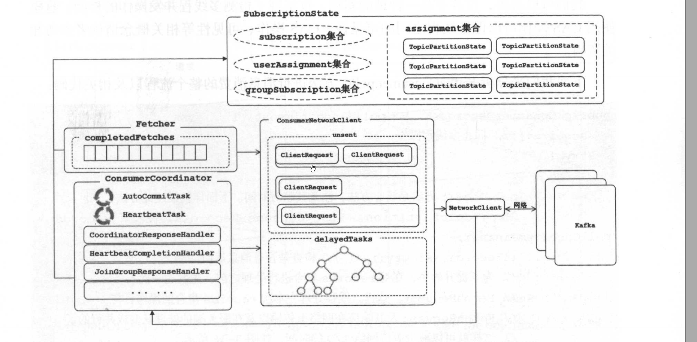

KafkaConsumer不是一个线程安全的类，为了 防止多线程并发操作，KafkaConsumer提供了多线程并发的检测机制，涉及的方法是acquire()和release()

KafkaConsumer.poll()函数是实际消费消息的函数，在此函数中会发送一次FetchRequest请求，和其他线程上的请求是并行的，不相互影响
图示：
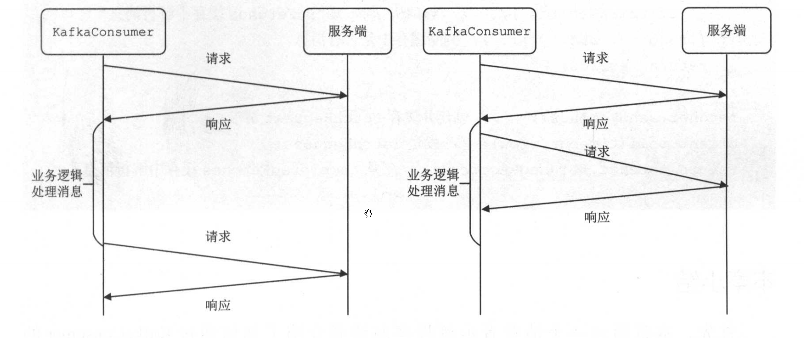


#Kafka服务端#

整个服务端架构图：
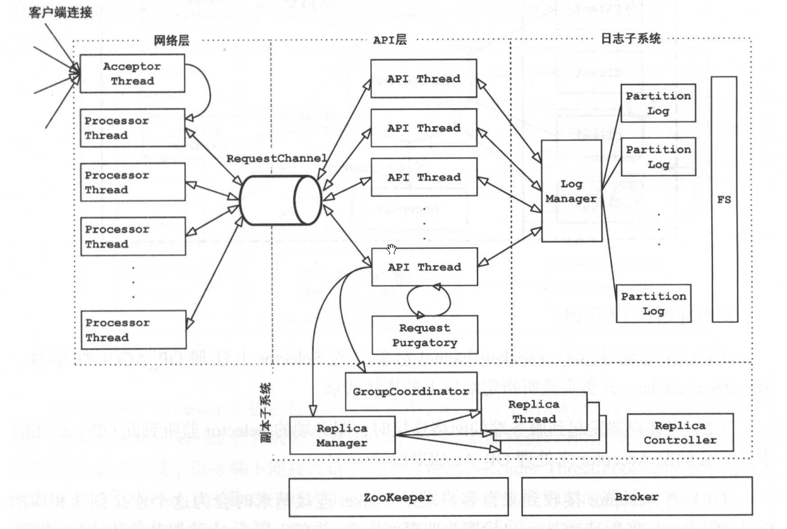


##网络层##
kafka的客户端会与服务端的多个broker创建网络连接，在这些网络连接上流传着各种请求及其相应，从而实现客户端与服务端之间的交互。
客户端一般情况下不会碰到大量数据访问、高并发的场景，所以客户端使用NetworkClient组件管理。Kafka服务端面对高并发、低延迟的请求，使用Reactor模式实现其网络层。
kafka的网络层管理的网络连接中不经有来自客户端的，还会有来自其他broker的网络连接。

####reactor模式####
模型：
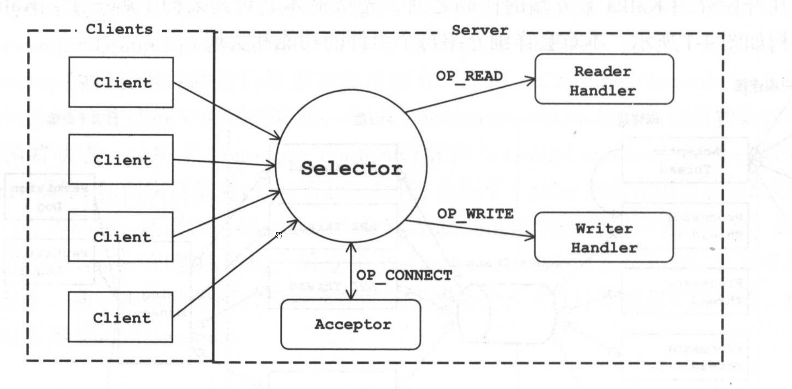

工作原理：
1. 首先创建ServerSocketChannel对象，并在Selector上注册OP_ACCEPT事件，ServerSocketChannel负责监听指定端口上的连接请求。
2. 当客户端发起到服务端的网络连接时，服务端的Selector监听到此OP_ACCEPT事件，会触发Acceptor来处理OP_ACCEPT
3. 当Acceptor接收到来自客户端的socket连接请求时，会为这个连接创建相应的SocketChannel，将SocketChannel设置为非阻塞模式，并在Selector上注册其关注的I/O事件，
例如OP_READ、OP_WRITE。此时，客户端与服务端之间的socket连接正式建立完成。
4. 当客户端通过上面建立的socket连接向服务端发送请求时，服务端的Selector会监听到OP_READ事件，并触发相应的处理逻辑(Reader Handler)。
当服务端可以向客户端写数据时，服务端的selector会监听到OP_WRITE事件，并触发执行相应的处理逻辑(Writer Handler)

**这些事件处理逻辑都是在同一线程中完成的。**

因此服务端对上述架构做了调整，将网络读写的逻辑与业务处理的逻辑进行拆分，让其由不同的线程池来处理，从而实现多线程处理
架构图：
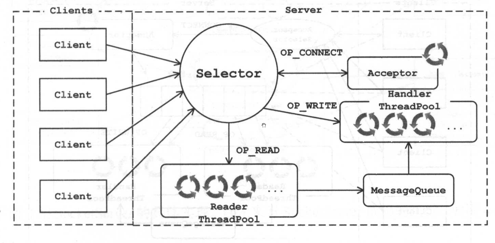

acceptro单独运行在一个线程中
Reader ThreadPool线程池中的所有线程都会在selector上注册OP_READ事件，负责服务端读取请求的逻辑，也是一个线程对应处理多个socket连接
Reader ThreadPool中的线程成功读取请求后，将请求放入MessageQueue这个共享队列中，
Handler ThreadPool线程池中的线程会从MessageQueue中取出请求，然后执行业务逻辑对请求进行处理。
当请求处理完成后，handler线程还负责产生响应并发送给客户端，这就要求Handler ThreadPool中的线程在selector中注册OP_WRITE事件，实现发送响应的功能。

多个selector的架构模型：
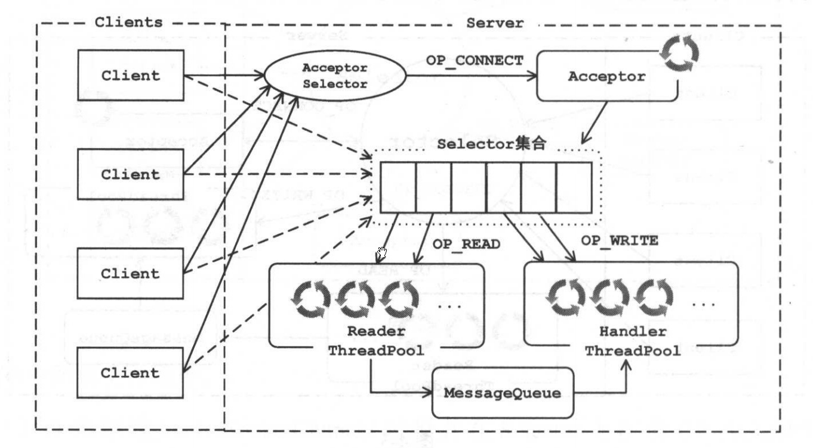

####SocketServer####
kafka的网络层是采用多线程、多个selector的设计实现的。核心类是SocketServer,其中一包含一个Acceptor用于接收并处理所有的新连接，每个Acceptor对应多个Processor线程，每个Processor线程拥有自己的selecotr，主要用于从连接中读取请求和写回响应。
每个acceptor对应多个Handler线程，主要用于处理请求，并将产生响应返回给Processor线程，Processor线程与Handler线程之间通过RequestChannel进行通信。
架构图：
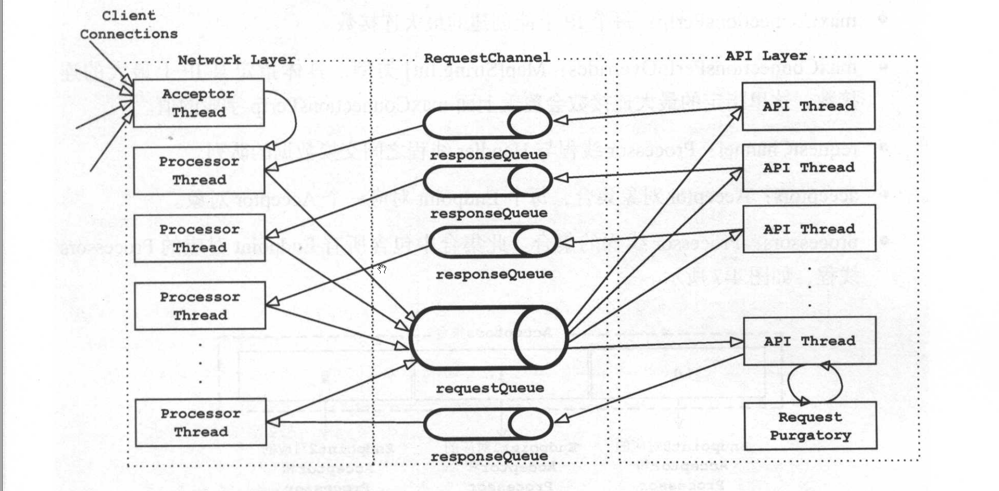

部分字段：
````
  /** Endpoint集合。一般的服务器有多快网卡，可以配置多个ip，kafka可以同时监听多个端口。Endpoint类中封装了需要监听的host、port及使用的网络协议，每个Endpoint都会创建一个对应的Acceptor对象 */
  private val endpoints = config.listeners
  /** Processor线程的个数 */
  private val numProcessorThreads = config.numNetworkThreads
  /** 在RequestChannel的requestQueue中缓存的最大请求个数 */
  private val maxQueuedRequests = config.queuedMaxRequests
  /** Processor线程的总个数 */
  private val totalProcessorThreads = numProcessorThreads * endpoints.size
  /** 每个IP上能创建的最大连接数 */
  private val maxConnectionsPerIp = config.maxConnectionsPerIp
  /** 具体制定某IP上最大的连接数 */
  private val maxConnectionsPerIpOverrides = config.maxConnectionsPerIpOverrides
  /** Processor线程与Handler线程之间交换数据的队列 */
  val requestChannel = new RequestChannel(totalProcessorThreads, maxQueuedRequests)
  /** Processor线程集合。此集合包含所有Endpoint对应的Processors线程 */
  private val processors = new Array[Processor](totalProcessorThreads)
  /** Acceptor对象集合，每个Endpoint对应一个Acceptor对象 */
  private[network] val acceptors = mutable.Map[EndPoint, Acceptor]()
  /** ConnectionQuotas类型对象。在ConnectionQuotas中，提供了控制每个IP上的最大连接数的功能 */
  private var connectionQuotas: ConnectionQuotas = _
````

processor线程集合
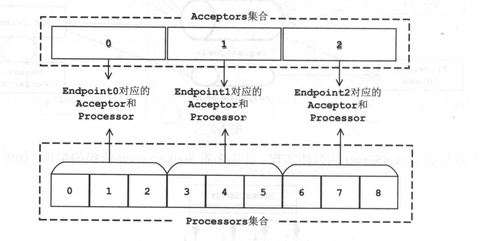

####AbstractServerThread####
关键字段：
````
  /** 标识当前线程的startup是否完成 */
  private val startupLatch = new CountDownLatch(1)
  /** 标识当前线程的shutdown操作是否完成 */
  private val shutdownLatch = new CountDownLatch(1)
  /** 标识当前线程是否存活，在shutdown()函数中会将alive设置为false */
  private val alive = new AtomicBoolean(true)
````

####Acceptor####
主要功能是接受客户端建立连接的请求，创建socket连接并分配给Processor处理


####Processor####
主要用于完成读取请求和写回响应的操作，Processor不参与具体业务逻辑的处理

在Acceptor.accept()函数中创建的SocketChannel会通过Processor.accept()函数交给Processor进行处理。
Processor.accept()函数接受到一个新的SocketChannel时会先将其放入newConnections队列中,然后会唤醒Processor线程来处理newConnections队列。


run()函数实现从网络连接上读取数据的功能

1. 首先调用startupComplete()函数，标识Processor的初始化流程已经结束，唤醒阻塞等待此Processor初始化完成的线程
2. 处理newConnections队列中的新建SocketChannel。队列中的每个SocketChannel都要在nioSelector上注册OP_READ事件。
	这里有个细节，SocketChannel会被封装成KafkaChannel，并附加(attach)到SelectionKey上，所有后面触发OP_READ事件时，
	从SelectionKey上获取的是KafkaChannel类型的对象。
3. 获取RequestChannel中对应的responseQueue队列，并处理其中的缓存的Response
	如果Response是SendAction类型，表示该Response需要发送给客户端，则查找对应的KafkaChannel，为其注册OP_WRITE事件，并将KafkaChannel.send字段指向待发送的Response对象。时还会将Response从responseQueue队列中移出，放入inflightResponses中。
	如果Response是NoOpAction类型，表示此连接暂无响应需要发送，则为KafkaChannel注册OP_READ，允许其继续读取请求
	如果Response是CloseConnectionAction类型，则关闭对应的连接
4. 调用SocketServer.poll()函数读取请求，发送响应。poll()底层调用的是KSelector.poll()函数。SocketServer.poll()函数每次调用都会将读取的请求、发送成功的请求以及断开的连接放入其completedReceives、completedSends、disconnected队列中等待处理。下面的步骤就是处理这些队列
5. 调用processCompletedReceives()函数处理KSelector.completedReceives队列。
	首先，遍历completedReceives，将NetworkReceive、ProcessorId、身份认证信息一起封装成RequestChannel.Reqeust对象并放入RequestChannel.requestQueue队列中，等待Handler线程的后续处理
	然后，取消对应KafkaChannel注册的OP_READ时间，表示在发送响应之前，此连接不能在读取任何请求
6. 调用processorCompletedSends()函数处理KSelector.completedSends队列。
	首先，将inflightResponses中保存的对应Response删除。
	然后，为对应连接重新注册OP_READ时间，允许从该连接读取数据。、
7. 调用processDisconnected()函数处理KSelector.disconnected队列。
	先从inflightResponses中删除该连接对应的所有Response。然后，减少ConnectionQuotas中记录的连接数，为后续的新建连接做准备
8. 当SocketServer.shutdown()关闭整个SocketServer时，将alive字段设置为false，循环结束。然后调用shutdownComplete()函数执行一系列关闭操作：
	关闭Processor管理的全部连接，减少ConnectionQuotas中记录的连接数,标识自身的关闭流程已经结束，唤醒等待该Processor结束的线程。
	
流程图如下：
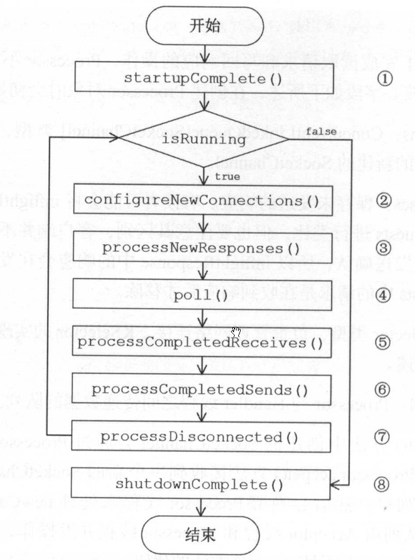

####RequestChannel####
Processor线程与Handler线程之间传递数据是通过ReqeustChannel完成的。在ReqeustChannel中包含了一个requestQueue队列和多个responseQueue队列，
每个Processor线程对应一个responseQueue。Processor线程将读取到的请求存入requestQueue中，Handler线程从requestQueue队列中取出请求进行处理；
Handler线程处理请求产生的响应会存放到Processor对应的responseQueue中，Processor线程从其对应的responseQueue中取出响应并发送给客户端。

结构图：
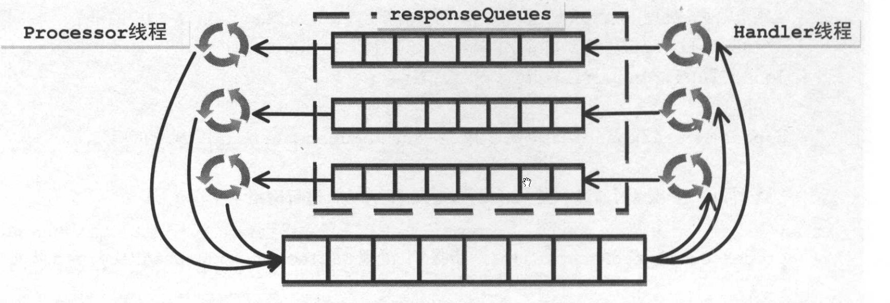

在RequestChannel中保存的是RequestChannel.Request和RequestChannel.Response两个类的对象。RequestChannel.Request会对请求进行解析，形成requestId(请求类型ID)、header(请求头)、body(请求体)等字段，供Handler线程使用，并提供了一些记录操作时间的字段供监控程序使用

一个请求从生产者到服务端的过程：
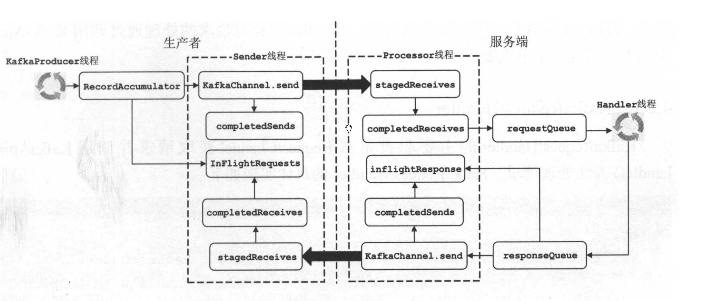

KafkaProducer线程创建ProducerRecord后，会将其缓存进RecordAccumulator。sender线程从RecordAccumulator中获取缓存的消息，放入KafkaChannel.send字段中等待发送，同时放入InFlightRequests队列中等待响应。之后客户端会通过KSelector将请求发送出去。
在服务端Processor线程使用KSelector读取请求，并暂存到stageReceives队列中，KSelector.poll()函数结束后，请求被转移到completeReceives队列中。
之后，Processor将请求进行一些解析操作后，放入RequestChannel.requestQueue队列。Handler线程会从RequestChannel.requestQueue队列中取出请求进行处理，将处理之后生成的响应放入RequestChannel.requestQueue队列。
Processor线程从其对应的RequestChannel.responseQueue队列中取出响应并放入inflightResponses队列中缓存，当响应发送出去之后会将其从inflightResponses中删除。
生产者读取响应的过程与服务端读取请求的过程类似，主要的区别是生产者需要对InFlightRequest中的请求进行确认。消费者与服务端之间的请求和响应的流转过程与上述过程类似。

##API层##
Handler线程会取出Processor线程，放入RequestChannel的请求进行处理，并将产生的响应通过RequestChannel传递给Processor线程。
Handler线程属于Kafka的API层，Handler线程对请求的处理通过调用KafkaApis中的方法实现。

####KafkaRequestHandler####
主要职责是从RequestChannel获取请求并调用KafkaApis.handle()函数处理请求。

API层使用KafkaRequestHandlerPool来管理所有的KafkaRequestHandler线程，KafkaRequestHandlerPool是一个简易版的线程池

####KafkaApis####
KafkaApis是kafka服务器处理请求的入口类。他负责将KafkaRequestHandler传递过来的请求分发到不同的handl* ()处理函数中，分发的依据是RequestChannel.Request中的requestId,此字段保存了请求的ApiKeys的值，不同的piKeys值表示不同请求的类型。

##日志存储##

kafka使用日志文件的方式保存生产者发送的消息。每条消息都有一个offset值来表示它在分区中的偏移量，这个offset值是逻辑值，并不是消息实际存放的物理地址。
offset值类似于数据库表中的主键，主键唯一确定了数据库表中的一条记录，offset唯一确定了分区中的一条消息

log结构图:
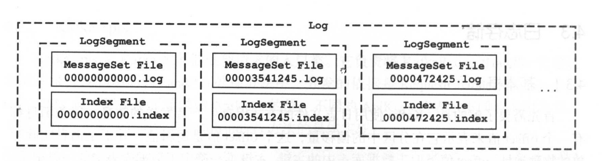

日志索引和文件对照图：
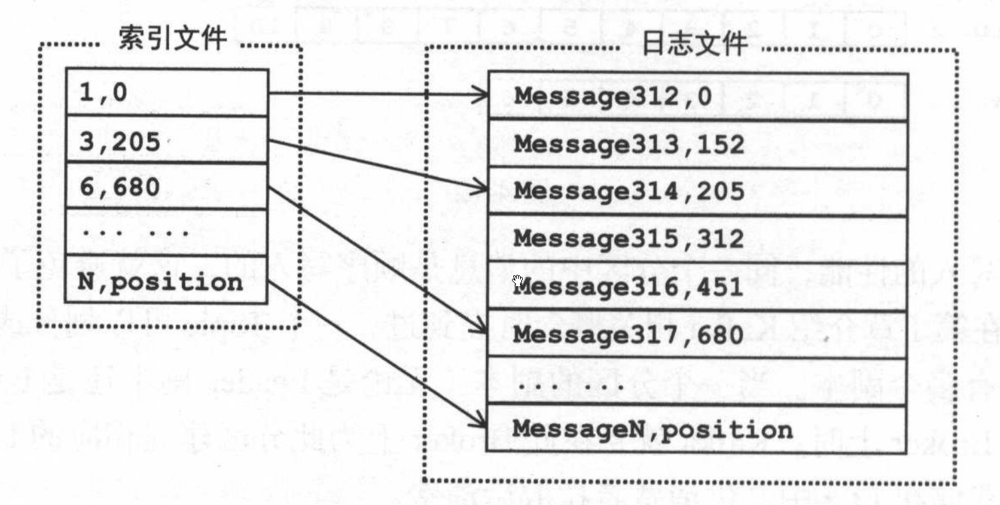

####FileMessageSet####
kafka使用FileMessageSet管理日志文件。它对应磁盘上的一个真正的日志文件。

继承自MessageSet。MessageSet中保存的数据格式分为三部分，8字节的offset值，4字节的size则表示message data大小，这两部分组成LogOverhead,message data部分保存了消息的数据，逻辑上对应一个message对象。


kafka使用Message类表示消息，Message使用ByteBuffer保存数据。
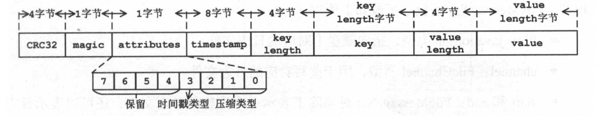

- CRC32:4个字节，消息的校验码
- magic:1字节，魔数标识，与消息格式有关，取值为0或1。当magic为0时，消息的offset使用绝对offset且消息格式中没有timestamp部分；
	当magic为1时，消息的offset使用相对offset且消息格式中存在timestamp部分。所以magic不同，消息的长度不同
- attributes:1字节，消息的属性。其中0表示无压缩，1标识gzip压缩，2标识snappy压缩，3表示lz4压缩。第3位标识时间戳类型，0表示创建时间，1表示追加时间
- timestamp:时间戳，其含义由attribute的第3位确定
- key length:消息key的长度。
- key：消息的key
- value length:消息value长度
- value:消息的value

部分字段：
````
file:java.io.File类型，指向磁盘上对应的日志文件
channel:FileChannel类型，用于读写对应的日志文件
start和end:FileMessageSet对象除了表示一个完整的日志文件，还可以表示日志文件分片(slice),start和end表示分片的起始位置。
isSlice:Boolean类型，表示当前FileMessageSet是否为日志文件的分片
_size:FileMessageSet大小，单位是字节
````

####ByteBufferMessageSet####
压缩消息日志文件，对应着客户端的批量消息压缩

**创建压缩消息**
服务端存储原理
1. 当生产产生创建压缩消息的时候，对压缩消息设置的offset是内部offset，即分配给每个消息的offset分别是0，1，2
2. 在kafka服务端为消息分配offset时，会根据外层消息中记录的内层压缩消息的个数为外层消息分配offset，为外层消息分配的offset是内存压缩消息中最后一个消息的offset值
3. 当消费者获取压缩消息后进行解压缩，就可以根据内部消息的、相对的offset和外层消息的offset计算出每个消息的offset值了

**迭代压缩消息**
MemoryRecords.RecordsIterator#next()函数
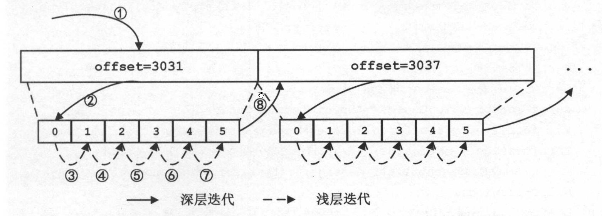
首先通过构造函数创建MemoryRecords.RecordsIterator对象，作为千层迭代器并调用next()函数，此时state字段为NOT_READY,调用makeNext()函数准备迭代项。
在makeNext()函数中会判断深层迭代是否完成(即innerDone()函数)，当前未开始深层迭代则调用getNextEntryFromStream()函数获取offset为3031的消息，如图中的步骤1
之后检测3031消息的压缩格式，假设采用GZIP的压缩格式，则通过private构造函数创建MemoryRecords.RecordsIterator对象作为深层迭代器，在构造过程中会创建对应的解压输入流。
然后调用getNextEntryFromStream()函数解压offset为3031的外层消息，其中嵌套的压缩消息形成logEntries队列。然后调用深层迭代器的next()函数，因为不存在第三层迭代，且logEntries不为空，
则从logEntries集合中获取消息并返回，此过程对应图中2.后续迭代中深层迭代未完成，则直接从logEntries集合中返回消息，图中3~7都会重复此过程。
当深层迭代完成后，调用getEntriyFromStream()函数获取offset为3032的消息，如图中步骤8。后续迭代过程与上述过程重复。

**ByteBufferMessageSet分析**
此为服务端解消息处理过程。

底层使用ByteBuffer保存消息数据ByteBufferMessageSet的角色和功能与MemoryRecords类似。主要提供了三个方面的功能：
1. 将Message集合按照制定的压缩类型进行压缩，此功能主要用于构建ByteBufferMessageSet对象，通过ByteBufferMessageSet.create()函数完成

2. 提供迭代器，实现深层迭代和浅层迭代两种迭代方式
3.提供了消息验证和offset分配的功能。

在ByteBufferMessageSet.create()方法中实现了消息的压缩以及offset分配，步骤：
1. 如果传入Message集合为空，则返回空ByteBuffer
2. 如果要求不对消息进行压缩，则通过OffsetAssigner分配每个消息的offset，在将消息写入到ByteBuffer之后，返回ByteBuffer.OffsetAssigner的功能是存储一串offset值，并像迭代器那样逐个返回
3. 如果要求对消息进行压缩，则先将Message集合按照指定的压缩方式进行压缩并保存到缓冲区，同时也会完成offset的分配，然后按照压缩消息的格式写入外层消息，最后将整个外层消息所在的ByteBuffer返回。


FileMessageSet.append()函数会将ByteBufferMessageSet中的全部数据追加到日志文件中，对于压缩消息来书，多条压缩消息就以一个外层消息的状态存在于分区日志文件中了。
当消费者获取消息时也会得到压缩的消息，从而实现“端到端压缩”

####OffsetIndex####
为了提高查找消息的性能，kafka为每个日志文件添加了对应的索引文件。OffsetIndex对象对应管理磁盘上的一个索引文件。与FileMessageSet共同构成一个LogSegment对象。

Kafka使用系数索引的方式构造消息的索引，它不保证每个消息在索引文件中都有对应的索引项目，这算是磁盘空间、内存空间、查找时间等多方面的这种。

OffsetIndex提供了向索引文件中添加索引项的append()函数，将索引文件截断到某个位置的truncateTo()函数和truncateToEntries()函数，进行文件扩容的resize()函数。

OffsetIndex中常用的查找相关的方法是二分查找，设计的方法是indexSlotFor()和lookup()。查找的目标是小于targetOffset的最大offset对应的物理地址(position)

####LogSegment####
为了防止Log文件过大，将Log切分成多个日志文件，每个日志文件对应一个LogSegment。在LogSegment中封装了一个FileMessageSet和一个OffsetIndex对象，提供日志文件和索引文件的读写功能以及其他辅助功能。

**append()**
追加消息功能:append()函数
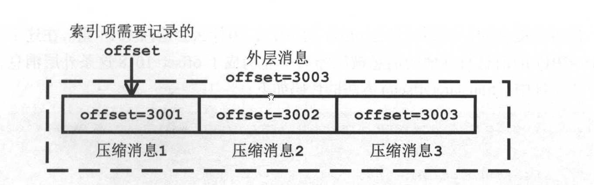

可能有多个handler线程并发写入同一个LogSegment,所以调用此方法必须保证线程安全。

**read()**
读取消息功能:read()函数
实现逻辑是：通过读取segments跳表，快速定位到读取的其实LogSegment并从中读取消息
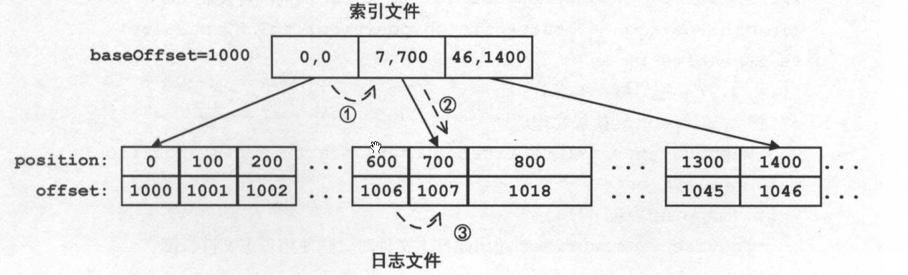
1. 将absoluteOffset转换成Index File中使用的相对offset，得到17。通过OffsetIndex.lookup()函数查找Index File,得到(7,700)这个索引项，步骤1
2. 根据(7,700)索引项，从MessageSet File中position=700处开始查找absoluteOffset为1017的消息，步骤2
3. 通过FileMessageSet.searchFor()函数遍历查找FileMessageSet,得到(1018,800)这个位置信息，步骤3

刷新数据到磁盘:flush()函数
将recoverPoint~LogEndOffset之间的数据刷新到磁盘上，并修改recoverPoint值
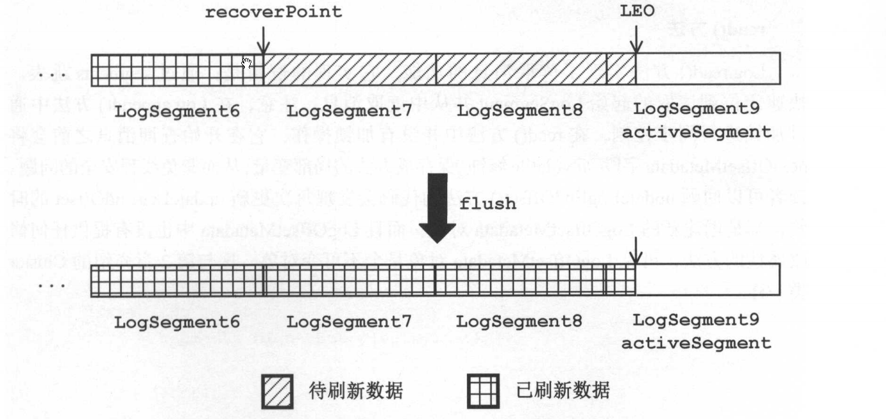

####LogManager####
在一个Broker上所有Log都是由LogManager进行管理的。LogManager提供了加载Log、创建Log集合、删除Log集合、查询Log集合等功能，并且启动了3个周期性的后台任务以及Cleaner线程(可能不只一个)，分别是log-flusher(日志刷写)任务、log-retention(日志保留)任务、recovery-point-checkpoint(检查点刷新)任务以及Cleaner线程(日志清理)。

关键字段：
````
logDirs:log目录集合，在server.properties配置文件中通过log.dirs项制定的多个目录。给么log目录下可以创建多个Log,每个Log都有自己对应的目录 LogManager在创建Log时会选择Log最少的log目录创建Log
ioThreads:为完成Log加载的相关操作，每个log目录下分配指定的线程执行加载。
scheduler:KafkaScheduler对象，用于执行周期性任务的线程池。与Log.flush()操作的scheduler是同一个对象
logs:用于管理TopicAndPartition与Log之间的对应关系。使用kafka自定义的Pool类型对象，底层使用JDK提供的线程安全的ConcurrentHashMap实现
dirLocks:FileLock集合。这些FileLock用来在文件系统层面为每个log目录加文件锁。在LogMananger对象初始化时，就会将所有log目录加锁
recoveryPointCheckpoints:用于管理每个log目录与其下的RecoveryPointCheckpoint文件之间的映射关系。
 在LogManager对象初始化时，会在每个log目录下创建一个对应的RecoveryPointCheckpoint文件。此map的value是OffsetCheckpoint类型的对象，
 其中封装了对应log目录下的RecoveryPointCheckpoint文件，并提供对RecoveryPointCheckpoint文件的读写操作。
 RecoveryPointCheckpoint文件中则记录了该log目录下的所有Log的recoveryPoint
logCreationOrDeletionLock:创建或删除Log时需要加锁进行同步
````

**定时任务**
在LogManager.startup()函数中，将三个周期性任务提交到scheduler中定时执行，并启动LogCleaner线程

log-retention任务：
核心方法：cleanupLogs()
描述：按照两个条件进行LogSegment的清理工作：一个是LogSegment的存活时间，二是整个Log的大小。
log-retention任务不仅会将过期的LogSegment删除，还会根据Log的大小决定是否删除最旧的LogSegment,以控制整个Log的大小

log-flusher任务：
核心方法：flushDirtyLogs()
描述：根据配置的时长定时对Log进行flush操作，保证数据的持久性

recovery-point-checkpoint任务
核心方法:checkpointRecoveryPointOffsets()
描述：定时将每个Log的recoveryPoint写入RecoveryPointCheckpoint文件中

**日志压缩**
此公国可以有效的减小日志文件的大小，环节磁盘紧张的情况。
如果消费者只关系key对应的最新value值，可以开启kafka的日志压缩功能，服务端会在后台启动Cleaner线程池，定期将相同key的消息进行合并，并保留最新的value值。

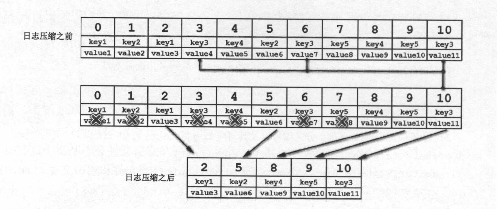

activeSegment不会参与日志要操作，而是只压缩其余的只读的LogSegment。
为了避免cleaner线程与其他业务线程长时间竞争CPU，并不会将activeSegment之外的所有LogSegment在一次压缩操作中全部处理掉，而是将这些LogSegment分批进行压缩。
每个Log都可以通过cleaner checkpoint切分成clean和dirty两部分，clean部分表示的是之前已经被压缩过的部分，而dirty部分则表示未压缩的部分。

每个Log需要进行日志压缩的迫切程度不同，每个cleaner线程只选取最迫切需要压缩的log进行处理。此“迫切程度”是通过cleanableRatio（dirty部分占整个log的比例）决定的

cleaner线程在选定需要清理的log后，首先为dirty部分的消息建立key与其last_offset(此key出现的最大offset)的映射关系，该映射通过SkimpyOffsetMap维护。
然后重新复制LogSegment，只保留SkimpyOffsetMap中记录的消息，抛弃掉其他消息。
经过日志压缩后，日志文件和索引文件会不断减小，cleaner线程还会对相邻的LogSegment进行合并，避免出现过小的日志文件和索引文件

在日志压缩时，value为空的消息会被认为是删除此key对应的消息的标志，此标志消息会保留一段时间，超时后会在下一次日志压缩操作中删除

LogCleanerManager主要负责每个log的压缩状态管理以及cleaner checkpoint信息维护和更新

关键字段：
````
checkpoints:用来维护data数据目录与cleaner-offset-checkpoint文件之间的对应关系
inProgress:用于记录正在进行清理的TopicAndPartition的压缩状态
lock:用于保护checkpoints集合和inProgress集合锁
pausedCleaningCond:用于线程阻塞等待压缩状态由LogCleaningAborted转换为LogCleaningPaused
````

压缩状态图：


当开始进行日志压缩任务时会先进入LogCleanInProgress状态；
压缩任务可以被暂停，此时进入LogCleaningPaused;
压缩任务若被中断，则先进入LogCleaningAborted状态，等待cleaner线程将其中的任务中止，然后进入LogCleaningPaused状态。
处于LogCleaningPaused状态的TopicAndPartition的日志不会再被压缩，直到有其他线程恢复其压缩状态

Cleaner.clean()步骤
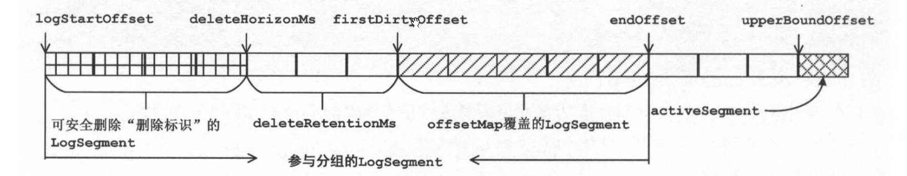

1. 首先，确定日志压缩的最大offset上限upperBoundOffset
2. 从firstDirtyOffset开始遍历LogSegment，并填充OffsetMap。在OffsetMap中记录每个key应该保留的消息的offset。当OffsetMap被填充满时，就可以确定日志压缩的实际上限endOffset
3. 根据deleteRetentionMs配置，计算可以安全删除的"删除标识"(即value为空的消息)的LogSegment
4. 将logStartOffset到endOffset之间的LogSegment进行分组，并按照分组进行日志压缩

**LogManager初始化**
LogManager初始化过程中，除了完成上面三个定时任务，还会完成相关的恢复操作和Log加载。

重要过程步骤：
1. 为每个log目录分配一个有ioThreads条线程的线程池，用来执行恢复操作
2. 检测Broker上次关闭是否正常，并设置Broker的状态。在Broker正常关闭时，会创建一个".kafka_cleansshutdown"的文件，通过此文件进行判断
3. 载入每个Log的recoveryPoint
4. 为每个Log创建一个恢复任务，交给线程池处理
5. 主线程等待所有的恢复任务完成
6. 关闭所有在步骤1中创建的线程池

LogManager初始化主要是在LogManager.loadLogs()函数中执行的

Log的初始化过程中会调用Log.loadSegments()函数。

步骤：
1. 删除".delete"和".cleaned"文件。
2. 加载全部的日志文件和索引文件。如果索引文件没有配对的日志文件，则删除索引文件；如果日志文件没有对应的索引文件，则重建索引文件
3. 处理步骤1中记录的".swap"文件，原理与日志压缩最后的步骤类似
4. 对于非空的Log，需要创建activeSegment，保证Log中至少有一个LogSegment。而对于非空Log,则需要进行恢复操作

##DelayedOperationPurgatory组件##
主要功能是管理延迟操作，底层依赖kafka的时间轮实现。

####TimeWheel####
一个存储定时任务的环形队列，底层使用数组实现，数组中的每个元素可以存放一个TimerTaskList对象。TimerTaskList是环形双向链表
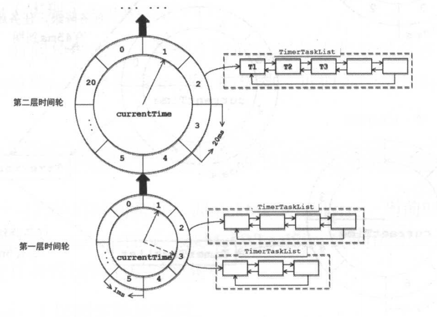

一个例子：
一个任务是在445ms后执行，默认情况下，各个层级的时间轮的时间格个数为20，
第一层时间轮每个时间格的跨度为1ms，整个时间轮的跨度为20ms，跨度不够。
第二次时间轮时间格的跨度为20ms，整个时间轮的跨度为400ms，跨度依然不够。
第三层时间轮时间格跨度为400ms，整个时间轮的跨度为8000ms，跨度足够。此任务存放在第三层时间轮的第一个时间格对应的TimerTaskList中等待执行，此时TimerTaskList到期时间是400ms。
随着时间的流逝，到此TimerTaskList到期时，距离该任务的到期时间还有45ms，不能执行任务。将其提交到层级时间轮中，此时第一层时间轮跨度依然不够，但是第二次时间轮的跨度足够，该任务会被放到第二层时间轮第三个时间格中等待执行。
如此往复几次，高层时间轮的任务会慢慢移动到底层的时间轮上，最终任务到期执行。

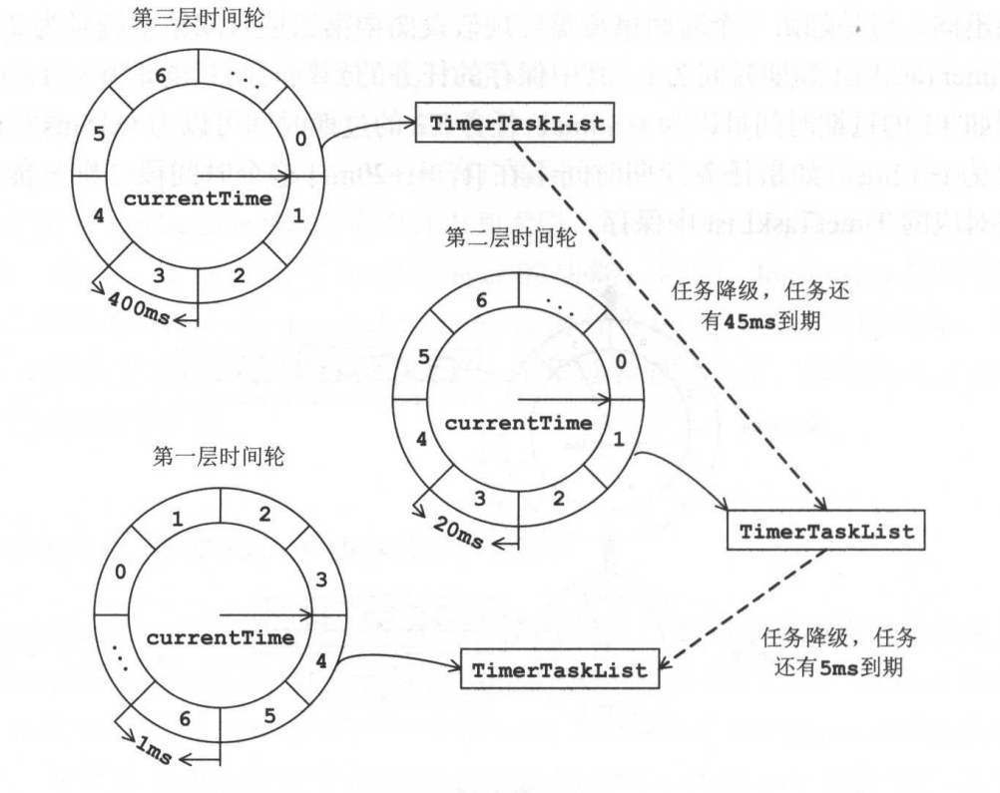

关键字段：
TimeTask使用了expiration字段记录了整个TimerTaskList的超时时间。TimerTaskEntry中的expirationMs字段记录了超时时间戳，timerTask字段指向了对应的TimeTask任务。
TimeTask中的delayMs记录了任务的延迟时间，timerTaskEntry字段记录了对应的TimerTaskEntry对象。
buckets:每一个项都对应时间轮中的一个时间格，用于保存TimerTaskList的数组。在TimingWheel中，同一个TimerTaskList中的不同定时任务到期时间可能不同，但是相差时间在同一个时间格的范围内
tickMs:当前时间轮中一个时间格表示的时间跨度
wheelSize:当前时间轮的格数，即buckets的大小
taskCounter:各层级时间轮中任务的总数
startMs:当前时间轮的创建时间
queue:DelayQueue类型，整个层级时间轮共用的一个任务队列，其元素类型是TimerTaskList
currentTime:时间轮的指针，将整个时间轮划分为到期部分和未到期部分。在初始化时，currentTime被修剪成tickMs的倍数，近似等于创建时间，但并不是严格的创建时间
interval:当前时间轮的时间跨度，即tickMs*wheelSize。当前时间轮只能处理时间范围在currentTime~currentTime+tickMs*wheelSize之间的定时任务，超过这个范围，则需要将任务添加到上层时间轮中
overflowWheel:上层时间轮的引用

####SystemTimer####
kafka中的定时器实现，在TimeWheel的基础上添加了执行到期任务、阻塞等待最近到期任务的功能

####DelayedOperation####
服务端在收到ProducerRequest和FetchRequest这两种请求的时候，并不是立即响应，可能会等一段时间后才返回。

对于ProducerRequest，其中的acks字段设置为-1，表示ProducerRequest发送到Leader副本后，需要ISR集合中所有副本都同步该请求中的消息(或超时)后，才能返回响应给客户端
ISR集合中的副本分布在不同Broker上，与Leader副本进行同步时就设计网络通信，一般情况下，网络传输是不可靠而且是一个较慢的过程，通常采用异步的方式处理来避免线程长时间等待。

当FetchRequest发送给Leader副本后，会积累一定量的消息后才返回给消费者或者Follower副本，并不是Leader副本的HW后移一条消息就立即返回给消费者，这是为了实现批量发哦少年宫，提高有效负载。

DelayedOperation表示延迟操作，对TimeTask进行扩展，除了有定时执行的功能，还提供了检测其他执行条件的功能。

DelayedOperation可能因为到期而被提交到SystemTimer.taskExecutor线程池中执行，也可能在其他线程检测其执行条件时发现已经满足执行条件，而将其执行。

DelayedOperation执行条件示意图
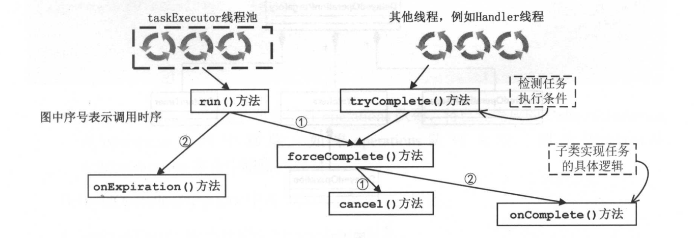

####DelayedOperationPurgatory####
提供了管理DelayedOperation以及处理到期DelayedOperation的功能。

####DelayedProduce####
ProducerRequest的在服务端的处理流程是：
在KafkaApis中处理ProducerRequest的方法是handleProducerRequest()函数，他会调用ReplicaManager.appendMessages()函数将消息追加到Log中，生成响应的DelayedProduce对象，并添加到delayedProducePurgatory处理。

1. 生产者发送ProducerRequest向某些指定分区追加消息
2. ProducerRequest经过网络层和API层的处理到达ReplicaManager，它会将消息交给日志存储子系统进行处理，最终追加到对应的Log中。同时还会检测delayedFetchPurgatory中相关key对应的DelayedFetch，满足条件则将其执行完成
3. 日志存储子系统返回追加消息的结果
4. ReplicaManager为ProducerRequest生成DelayedProduce对象，并交由delayedProducePurgatory管理
5. delayedProducePurgatory使用SystemTimer管理DelayedProduce是否超时
6. ISR集合中的Follower副本发送FetchRequest请求与Leader副本同步消息。同时，也会检查DelayedProduce是否符合执行条件
7. DelayedProduce执行时会调用回调函数产生ProducerResponse，并将其添加到RequestChannels中
8. 由网络层将ProducerResponse返回给客户端。


####DelayedFetch####
DelayedFetch是FetchRequest对应的延迟操作，原理与DelayedProduce类似。
来自消费者或者Follower副本的FetchRequest由KafkaApis.handleFetchRequest()函数处理，他会调用ReplicaManager.fetchMessages()函数从响应的Log中读取消息，并生成DelayedFetch添加到delayedFetchPurgatory中处理

来自follower的副本流程
1. Follower副本发送FetchRequest，从某些分区中获取消息
2. FetchRequest经过网络层和API层的处理，到达ReplicaManager，它会从日志子系统中读取数据，并检测是否要更新ISR集合、HW等，之后还会执行delayedProducePurgatory中满足条件的相关DelayedProduce.
3. 日志存储子系统返回读取消息以及相关信息，例如此次读取到的offset等
4. ReplicaManager为FetchRequest生成DelayFetch对象，并交由delayedProducePurgatory管理
5. delayedFetchPurgatory使用SystemTimer管理DelayedFetch是否超时
6. 生产者发送ProduceRequest请求追加消息，同时也会检查DelayedFetch是否符合执行条件
7. DelayedFetch执行时会调用回调函数产生FetchResponse，添加到RequestChannels中
8. 由网络层将FetchResponse返回给客户端

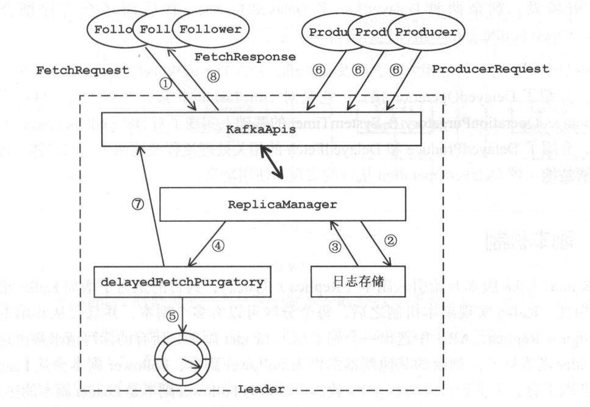


##副本机制##
每个分区可以有多个副本，并且会从其副本集合中选出一个副本作为Leader副本，所有的读写请求都由选举出的Leader副本处理。剩余的其他副本都作为Follower副本，Follower副本会从leader副本处获取消息，并更新到自己的log中。
可以认为follower副本是leader副本的热备份。

####副本####
在一个分区的leader副本中会维护自身以及所有follower副本的相关状态，而follower副本只维护自己的状态。
本地副本：副本对应的Log分配在当前的broker上；
远程副本：副本对应的Log分配在其他的broker上；

在当前broker上仅仅维护了副本的LogEndOffset等信息。
一个副本是"本地副本"还是"远程副本"与它是leader副本还是follower副本没有直接联系

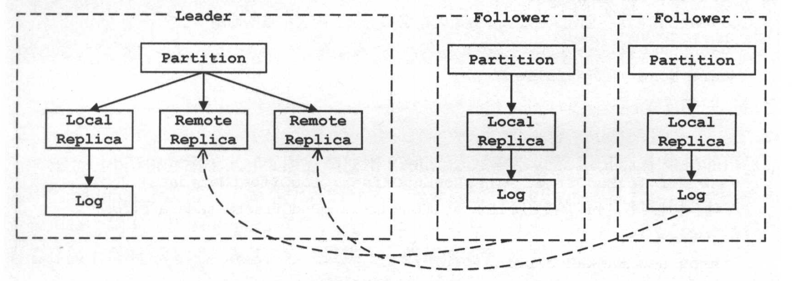

kafka使用Replica对象表示一个分区的副本。重要字段：
````
brokerId:标识该副本所在的broker的id。区分一个副本是"本地副本"还是"远程副本"，可以通过Replica.brokerId字段与当前broker的id进行比较
highWatermarkMetadata：用来记录HW(HighWatermark)的值。消费者只能获取到HW之前的消息，其后的消息对消费者是不可见的。
 此字段由leader副本负责维护，更新时机是消息被ISR集合中所有副本成功同步，即消息被成功提交。
logEndOffsetMetadata：对于本地副本，此字段记录的是追加到Log中的最新消息的offset，可以直接从Log.nextOffsetMetadata字段中获取。
 对于远程福分，此字段含义相同，但是由其他Broker发送请求来更新此值，并不能直接从本地获取到
partition:此副本对应的分区
log:本地副本对应的Log对象，远程副本此字段为空
lastCaughtUpTimeMsUnderlying：用于记录follower副本最后一次追赶上leader的时间戳
````

####分区####
服务端使用Partition表示分区，Partition负责管理每个副本对应的Replica对象，进行leader副本的切换，ISR集合的管理以及调用日志存储子系统完成写入消息，以及一些其他的辅助方法。

````
topic:此partition对象代表的topic名称
partitionId：此partition对象代表的分区编号
localBrokerId：当前broker的id，可以与replicaId比较，从而判断指定的Replica是否表示本地副本
logManager：当前broker上的LogManager对象
zkUtils：操作ZooKeeper的辅助类
leaderEpoch:leader副本的年代信息
leaderReplicaIdOpt：该分区的leader副本的id
inSyncReplicas：该集合维护了分区的ISR集合，ISR集合是AR集合的子集
assignedReplicaMap：维护了该分区的全部副本的集合（AR集合）的信息
````

**创建副本**
getOrCreateReplica()函数主要负责在AR集合(assignedReplicaMap)中查找指定副本的Replica对象，如果查找不到则创建Replica对象，并添加到AR集合中进行管理。如果创建是Local Replica，还会创建(或恢复)对应的Log并初始化(或恢复)HW
HW与Log.recoveryPoint类似，也会需要记录文件中保存，在每个lig目录下都有一个replication-offset-checkpoint文件记录了此目录下每个分区的HW.
在ReplicaManager启动时，会读取此文件到highWatermarkCheckpoints这个map中，之后会定时更新replication-offset-checkpoint文件

**副本角色切换**
Broker会根据KafkaController发送的LeaderAndISRRequest请求控制副本的leader/follower角色切换。

**ISR集合管理**
Partition除了对副本的leader/follower角色进行管理，还需要管理ISR集合。随着follower副本不断与leader副本进行消息同步，follower副本的LEO会逐渐后移，并最终赶上leader副本的LEO，此时该follower副本就有资格进入ISR集合。

主要是maybeExpandIsr()函数和maybeShrinkIsr()函数

在ISR集合发生增减的时候，都会将最新的ISR集合保存到zookeeper中，具体的保存路径是:/brokers/topics/[topic_name]/partitions/[partitionId]/state

**追加消息**
在分区中，只有leader副本能够处理读写请求。Partition.appendMessagesToLeader()函数提供了向leader副本对应的Log中追加消息的功能。

**checkEnoughReplicasReachOffset**
此函数会检测其参数指定的消息是否已经被ISR集合中所有follower副本同步

####ReplicaManager####

管理一个broker范围内的Partition信息
此实现依赖于日志存储子系统,DelayedOperationPurgatory、KafkaScheduler组件。底层依赖于Partition和Replica
关键字段：
logManager:对分区的读写操作都委托给底层的日志存储子系统
scheduler:用于执行ReplicaManager中的周期性定时任务。在ReplicaManager中总共有三个周期性任务:highwatermark-checkpoint、isr-expiration、isr-change-propagation
controllerEpoch:记录KafkaController年代信息，当重新选举controller leader时该字段值会递增。之后，在ReplicaManager处理来自KafkaController的请求时，
 会先检测请求中携带的年代信息是否等于controllerEpoch的值，就避免了接受旧controller leader发送的请求。
localBrokerId：当前broker的id，用于查找local replica
allPartitions:保存了当前broker上分配的所有partition信息。
replicaFetcherManager，在ReplicaFetcherManager中管理了多个ReplicaFetcherThread线程，ReplicaFetcherThread线程会向leader副本发送FetchRequest请求来获取消息，实现follower副本与leader副本同步。
 ReplicaFetchManager对象在ReplicaManager初始化时被创建。
highWatermarkCheckpoints：用于缓存每个log目录与OffsetCheckpoint之间的对应关系，OffsetCheckpoint记录了对应log目录下的replication-offset-checkpoint文件，该文件中记录的data目录下每个partiton的HW
 ReplicaManager中的highwatermark-checkpoint任务会定时更新replication-offset-checkpoint文件的内容
isrChangeSet:用于记录ISR集合发生变化的分区信息
delayedProducePurgatory、delayedFetchPurgatory：用于管理DelayedProduce和DelayedFetch的DelayedOperationPurgatory对象
zkUtils：操作Zookeeper的辅助类

**副本角色切换**
在kafka集群会选举一个broker成为KafkaController的leader，它负责管理整个kafka集群。
controller leader根据partition的leader副本和follower副本的状态向对应的broker节点发送LeaderAndIsrRequest，这个请求用于副本的角色切换，

线路图：
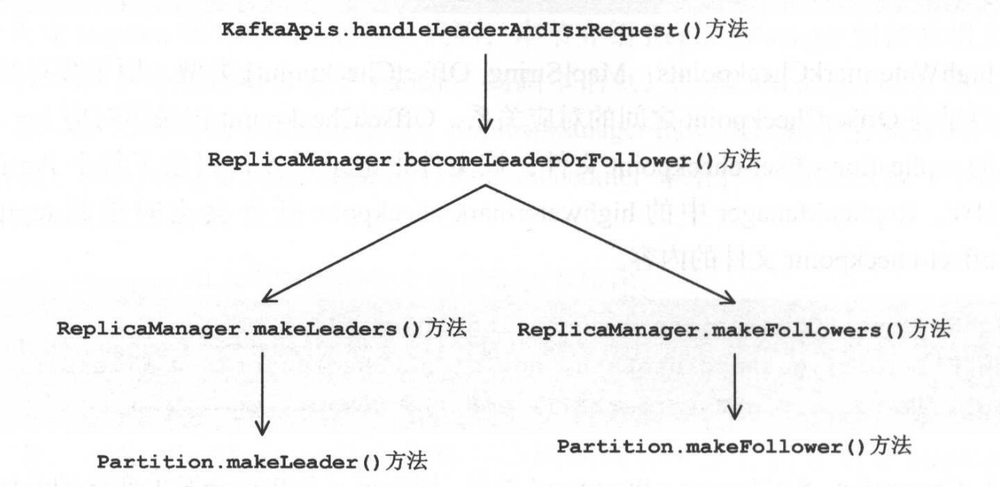

**追加/读取消息**
appendToLocalLog()函数和readFromLocalLog()函数

updateFollowerLogReadResults():当ISR集合中所有follower副本都已经同步了某消息时，kafka认为消息已经成功提交，可以将HW后移。所以针对来自follower副本的FetchRequest多了一步处理.

**消息同步**
follower副本与leader副本同步的功能是由ReplicaFetcherManager组件实现
AbstractFetcherManager.addFetcherForPartitions()函数

**关闭副本**
当broker收到来自KafkaController的StopReplicaRequest时，会关闭其指定的副本，并根据StopReplicaRequest中的字段决定是否删除副本对应的Log.在分区副本进行重新分配、关闭Broker等过程中都会使用此请求。
在重新分配Partition副本时，就需要将旧副本及其log删除

主要是ReplicaManager.stopReplicas()函数进行处理

**ReplicaManager中的定时任务**
highwatermark-checkpoint:会周期性的记录每个Replica的HW，并保存到其他log目录中的replication-offset-checkpoint文件中
isr-expiration:周期性的调用maybeShrinkIsr()函数检测每个分区是否需要缩减其ISR集合
isr-change-propagation:周期性的将ISR集合发生变化的分区记录到Zookeeper中

**MetadataCache**
MetadataCache是broker用来缓存整个集群中全部分区状态的组件。
KafkaController通过向集群中的broker发送UpdateMetadataRequest请求来更新其MetadataCache中缓存的数据，每个broker在收到该请求后会异步更新MetadataCache中的数据

##KafkaController##
在kafka集群的多个broker中，有一个broker会被选举为controller leader，负责管理整个集群中所有的分区的副本的状态。
例如当某分区的leader副本出现故障时，由controller负责为该分区重新选举新的leader副本；
当使用kafka-topics脚本增加某topic的分区数量，由controller管理分区的重新分配；
当检测到分区的ISR集合发生变化时，由controller通知集群中所有的broker更新其MetadataCache信息

为了实现Controller的高可用，一个broker被选为leader之后，其他的broker都会成为follower，当leader出现故障之后，会从剩下的follower中选出新的follower中选出新的controller leader来管理集群。

选举controller leader依赖于zookeeper实现，每个broker启动时都会创建一个KafkaController对象，但是集群中只能存在一个controller leader来对外提供服务。
在集群启动时，多个broker上的KafkaController会在指定路径下竞争创建节点，只有第一个成功创建节点的KafkaController才能成为leader，而其余的KafkaController则成为follower
当leader出现故障之后，所有的follower会收到通知，再次竞争在该路径下创建节点，从而选出新的leader。

/brokers/ids/[id]:记录集群中可用broker的id
/brokers/topics/[topic]/partitions:记录一个topic中所有分区的分配信息以及AR集合信息
/brokers/topics/[topic]/partitions/[partition_id]/state:记录某个partition的leader副本所在的brokerId、lead_epoch、ISR集合、ZKVersion信息
/controller_epoch:记录当前controller leader的年代信息
/controller:记录当前controller leader的id，也用于controller leader 选举
/admin/reassign_partitions:记录需要进行副本分重新分配的分区
/admin/preferred_replica_election:记录里需要进行"优先副本的"选举的分区。
/admin/delete_topics:记录了待删除的topic
/isr_change_notification:记录一段时间之内ISR集合发生变化的分区
/config:记录一些配置信息

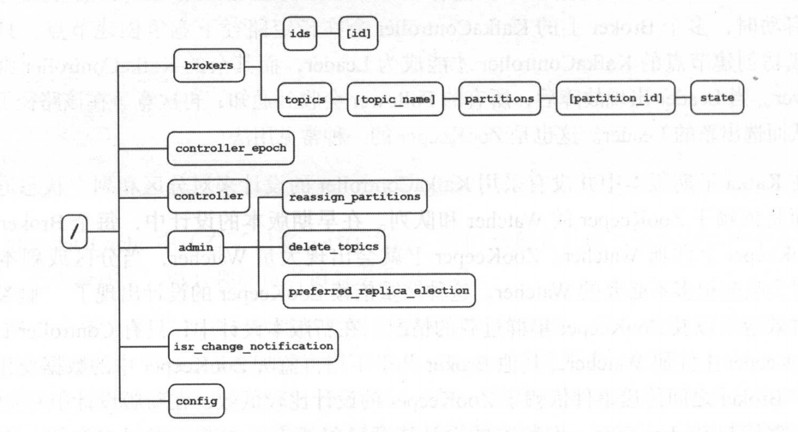


KafkaController是zookeeper与kafka集群交互的桥梁：一方面对zookeeper进行监听，其中过包括broker写入到zookeeper中的数据，也包括管理员使用脚本写入的数据；
另一方面根据zookeeper中数据的变化做出相应的处理，通过LeaderAndIsrRequest/StopReplicaRequest/UpdateMetadataRequest等请求控制每个broker的工作
而且KafkaController本身也通过zookeeper提供了高可用的机制

####ControllerChannelManager####
KafkaController使用ControllerChannelManager管理其与集群中各个broker之间的网络交互。

####ControllerContext####
KafkaController的上下文信息，缓存了zookeeper中记录的整个集群的元信息。如可用broker、全部topic、分区、副本
可以看做zookeeper数据的缓存

####ControllerBrokerRequestBatch####
向broker批量发送请求的功能

####PartitionStateMachine####
管理集群中所有partition状态的状态机

分区状态转换图：
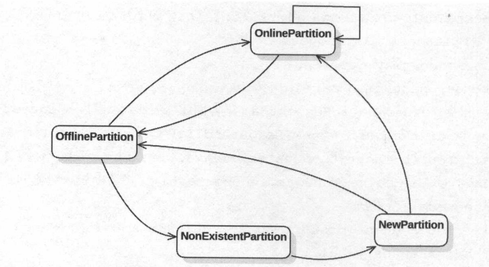

NonExistentPartition->NewPartition
从zookeeper中加载分区的AR集合到ControllerContext的partitionReplicaAssignment集合中

NewPartition->OnlinePartition
首先将leader副本的ISR集合的信息写入到zookeeper中，这里会将分区的AR集合中第一个可用的副本选举为leader副本，并将分区的所有可用副本作为ISR集合。
之后向所有可能的副本发送LeaderAndIsrRequest，指导这些副本进行leader/follower的角色切换，并向所有可用的broker发送UpdateMetadataRequest来更新其上的MetadataCache

OnlinePartition/OfflinePartition->OnlinePartition
为分区选择新的leader副本和ISR集合，并将结果写入zookeeper。之后，向需要进行角色切换的副本发送LeaderAndIsrRequest，指导这些副本进行Leader/Follower的角色进行切换，并向所有可用的broker发送UpdateMetadataRequest来更新其上的MetadataCache

NewPartition/OnlinePartition->OfflinePartition
只进行状态切换，并没有其他的操作

OfflinePartition->NonExistentPartition
只进行状态切换，并没有其他的操作


####PartitionLeaderSelector####
Leader副本选举、确定ISR集合的

NoOpLeaderSelector：没有进行leader选举，而是将currentLeaderAndIsr直接返回，需要接收以及需要接收LeaderAndIsrRequest的broker则是分区的AR集合
OfflinePartitionLeaderSelector：会根据currentLeaderAndIsr选举新的leader和ISR集合。 策略如下
	1. 如果在ISR集合中存在至少一个可用的副本，则从ISR集合中选择新的Leader副本，当前ISR集合为新ISR集合
	2. 如果ISR集合中没有可用的副本，且"unclean leader election"配置被禁用，那么就抛出异常
	3. 如果"unclean leader election"被开，则从AR集合中选择新的leader副本和ISR集合
	4. 如果AR集合中没有可用的副本，抛出异常
ReassignedPartitionLeaderSelector：涉及到副本的重新分配。
	选取的新leader必须在新指定的AR集合中，且同时在当前ISR集合中，当前ISR集合为新ISR集合，接收LeaderAndIsrRequest的副本是新指定的AR集合中的副本
PreferredReplicaPartitionLeaderSelector：如果"优先副本"可用且在ISR集合中，则选取其为leader副本，当前的ISR集合为新的ISR集合，并向AR集合中所有可用副本发送LeaderAndIsrRequest，否则会抛出异常
ControlledShutdownLeaderSelector：从当前ISR集合中排除正在关闭的副本后作为新的ISR集合，从新ISR集合中选择新的leader，需要向AR集合中可用的副本发送LeaderAndIsrRequest

####ReplicaStateMachine####
controller leader用于维护副本状态的状态机。
一共有7个状态：
NewReplica：创建新topic或进行副本重新分配时，新创建的副本就处于此状态。处于此状态的副本只能成为follower副本
OnlineReplica：副本开始正常工作时处于此状态，处在此状态的副本可以成为leader副本，也可以成为follower副本
OfflineReplica：副本所在的broker下线后，会转换为此状态
ReplicaDeletionStarted：刚开始删除副本时，会先将副本状态转换为此状态，然后开始删除
ReplicaDeletionSuccessful：副本被成功删除后，副本状态会处于此状态
ReplicaDeletionIneligible：如果副本删除操作失败，会将副本转换为此状态
NonExistentReplica：副本被成功删除后，最终转换为此状态

副本状态切换：
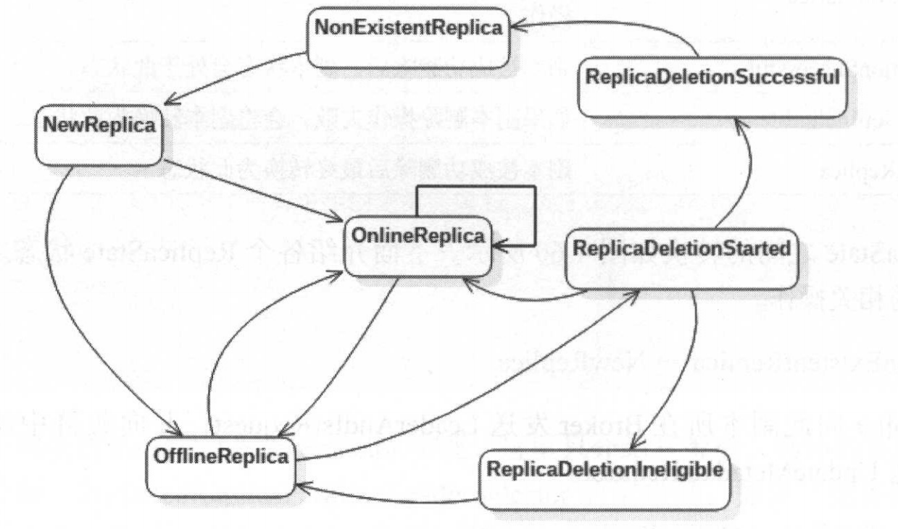

NonExistentReplica -> NewReplica
controller向此副本所在的broker发送LeaderAndIsrRequest，并向集群中所有可用的broker发送UpdateMetadataRequest

NewReplica -> OnlineReplica
controller将NewReplica加入到AR集合中

OnlineReplica/OfflineReplica -> OnlineReplica
controller向此副本所在的broker发送LeaderAndIsrRequest，并向集群中所有可用的broker发送UpdateMetadataRequest

NewReplica/OnlineReplica/OfflineReplica/ReplicaDeletionIneligible -> OfflineReplica
controller向副本所在的broker发送StopReplicaRequest，之后会从ISR集合中清除此副本，最后向其他可用副本所在的broker发送LeaderAndIsrRequest，并向集群中所有可用的broker发送UpdateMetadataRequest

OfflineReplica -> ReplicaDeletionStarted
controller向副本所在broker发送StopReplicaRequest

ReplicaDeletionStarted -> ReplicaDeletionSuccessful
只做状态转换，并没有其他操作

ReplicaDeletionStarted -> ReplicaDeletionIneligible
只做状态转换，并没有其他操作

ReplicaDeletionSuccessful -> NonExistentReplica
controller从AR集合中删除此副本

设置每个副本状态的根据是controllerContext.partitionLeadershipInfo中记录的broker状态

####zookeeper listener####
在zookeeper的指定节点上添加listener，监听此节点中的数据变化或是其子节点的变化，从而出发相应的逻辑业务

**TopicChangeListener**
负责管理topic的增删，监听"/brokers/topics"节点的子节点变化

**TopicDeletionManager与DeleteTopicsListener**
TopicDeletionManager中维护了多个集合，用于管理待删除的topic和不可删除的集合，他会启动一个DeleteTopicsThread线程来执行删除topic的具体逻辑
当topic满足下列三种情况之一时，不能被删除：
1. 如果topic中的任一分区正在重新分配副本，则此topic不能被删除
2. 如果topic中的任一分区正在进行"优先副本"选举，则此topic不能被删除
3. 如果topic中的任一分区的任一副本所在的broker宕机，则此topic不能删除

删除的过程主要在DeleteTopicsThread.doWork()中进行
1. 获取待删除topic的分区集合，构成UpdateMetadataRequest发送给所有的broker，将broker中MetadataCache的相关信息删除，这些分区不再对外提供服务
2. 调用onTopicDeletion()函数开始对指定分区进行删除
	a. 将不可用副本转换成ReplicaDeletionIneligible状态
	b. 将可用副本转换成OfflineReplica状态，此步骤会发送StopReplicaRequest到待删除的副本(不会删除副本)，   同时还会向可用的broker发送LeaderAndIsrRequest和UpdateMetadataRequest，将副本从ISR集合中删除
	c. 将可用副本由OfflineReplica转换成ReplicaDeletionStarted,此步骤会想可用副本发送StopReplicaRequest（删除副本），并设置回调函数处理StopReplicaResponse
3. 调用deleteTopicsStopReplicaCallback()处理StopReplicaResponse
	a. 如果StopReplicaResponse中的错误码表示出现异常，则将副本状态转换为ReplicaDeletionIneligible，并标记此副本所在topic不可删除，即将topic添加到topicsIneligibleForDeletion队列，最后幻想DeleteTopicsThread线程
	b. 如果StopReplicaResponse正常，则将副本状态转换为ReplicaDeletionSuccessful，并唤醒DeleteTopicsThread线程
4. 经过上述三个步骤后，开始第二次doWork()调用。如果待删除的Topic的所有副本已经处于ReplicaDeletionSuccessful状态，调用completeDeleteTopic()函数完成topic的删除
	a. 取消partitionModificationsListeners监听
	b. 将此topic的所有副本从ReplicaDeletionSuccessful转换为NonExistentReplica。此步骤会将副本对应的Replica对象从ControllerContext中删除
	c. 将topic的所有分区换换为OfflineReplica状态，紧接着会再转换为NonExistentReplica
	d. 将topic和相关的分区从topicsToBeDeleted集合和partitionsToBeDeleted集合中删除
	e. 删除zookeeper以及ControllerContext中与此topic相关的全部信息
5. 如果还有副本处于ReplicaDeletionStarted状态，则表示还没有收到StopReplicaResponse，则继续等待
6. 如果topic的任一副本处于ReplicaDeletionIneligible状态，则表示此topic不能被删除，调用markTopicForDeletionRetry()将处于ReplicaDeletionIneligible状态的副本重新转换成OfflineReplica状态。按2->b中的流程


DeleteTopicsListener：监听zookeeper中"/admin/delete_topics"节点下子节点变化。

当TopicCommand在该路径下添加需要被删除的topic时，DeleteTopicsListener会被触发，他会将该待删除的topic交由TopicDeletionManager执行topic删除操作

**PartitionModificationsListener**
监听"/brokers/topics/[topic_name]"节点中的数据变化，主要用于监听一个topic的分区变化。

**BrokerChangeListener**
监听"/brokers/ids"节点下的子节点变化，主要负责处理broker的上线和故障下线。当broker上线时会在"/brokers/ids"下创建临时节点，下线时会删除对应的临时节点。

**IsrChangeNotificationListener**
当follower副本追上leader副本时，会被添加到ISR集合中，当follower副本与leader副本差距太大时会被剔除ISR集合。
leader副本不仅会在ISR集合变化时将其记录到zookeeper中，还会调用ReplicaManager.recordIsrChanege()函数，记录到isrChangeSet集合中，之后通过isr-change-propagation定时任务将该集合中周期性的写入到zookeeper的"/isr_change_notification"路径下。

IsrChangeNotificationListener用于监听"/isr_change_notification"路径下的子节点变化，当某些分区的ISR集合变化时，通知整个集群中的所有broker

**PreferredReplicaElectionListener**
负责监听zookeeper节点"/admin/preferred_replica_election"。
当我们通过PreferredReplicaLeaderElectionCommand命令指定某些分区进行"优先副本"选举时，会将指定分区的信息写入该节点，从而触发PreferredReplicaElectionListener进行处理。进行"优先副本"选举的目的是让分区的"优先副本"重新成为leader副本

**副本重新分配的相关Listener**

PartitionsReassignedListener监听的是zookeeper节点"/admin/reassign_partitions".
当管理人员通过ReassignPartitionsCommand命令指定某些分区需要重新分配副本时，会将指定分区的信息写入该节点，从而触发PartitionsReassignedListener进行处理

副本重新分配的步骤:
1. 从zookeeper的"/admin/reassign_partitions"节点下读取分区进行重新分配信息
2. 过滤掉正在进行重新分配的分区
3. 检测其topic是否为待删除的topic，如果是，则调用KafkaController.removePartitionFromReassignedPartitions()函数
	a. 取消此分区注册的ReassignPartitionsIsrListener.
	b. 删除zookeeper的"/admin/reassign_partitions"节点中与当前分区相关的数据
	c. 从partitionsBeingReassigned集合中删除分区相关的数据
4. 否则，创建ReassignedPartitionsContext,调用initiateReassignReplicasForTopicPartition()方法开始为重新分配副本的做一些准备工作
	a. 首先，获取当期那的旧AR集合和指定的新AR集合
	b. 比较新旧两个AR集合，若两者完全一样，则抛出异常，执行步骤3的操作后结束
	c. 判断新AR集合中涉及的broker是否都是可用的，若不是抛出异常，执行步骤3的操作后结束
	d. 为分区添加注册ReassignPartitionsIsrChnageListener
	e. 将分区添加到partitionsBeingReassigned集合中，并标识该topic不能被删除
	f. 调用onPartitionReassignment()函数，开始执行副本重新分配
5. onPartitionReassignment()函数完成了副本分配的整个流程
6. 判断新AR集合中的所有副本是否已经进入ISR集合。如果没有，则执行下面的步骤
	a. 将分区在ContextController和zookeeper中的AR集合更新成"新AR+旧AR"
    b. 向"新AR+旧AR"发送LeaderAndIsrRequest，此步骤主要目的是为了增加zookeeper中记录的leader_epoch值
    c. 将"新AR-旧AR"中的副本更新成NewReplica状态，此步骤会向这些副本发送LeaderAndIsrRequest使其称为follower副本，并发送UpdateMetadataRequest
7. 如果新AR集合中的副本已经进入了ISR集合，则执行下面的步骤
	a. 将新AR集合中的所有副本都转换成OnlineReplica状态
    b. 将ControllerContext中的AR记录更新为新AR集合
    c. 如果当前leader副本在新AR集合中，则递增zookeeper和ControllerContext中记录的leader_epoch值，并发送LeaderAndIsrRequest和UpdateMetadataRequest
    d. 如果当前leader不在新AR集合中或leader副本不可用，则将分区状态转换为OnLinePartition(之前也是OnlinePartition)，主要目的使用ReassignedPartitionLeaderSelector选举新的leader副本，使得新AR集合中的一个副本成为新leader副本，然后会发送LeaderAndIsrRequest和UpdateMetadataRequest
    e. 将"旧AR-新AR"中的副本转换成为OfflineReplica，此步骤会发送StopReplicaRequest(不删除副本)，清理ISR集合中的相关副本，并发送LeaderAndIsrRequest和UpdateMetadataRequest
    f. 接着将"旧AR-新AR"中的副本转换成ReplicaDeletionStarted，此步骤会发送StopReplicaRequest(删除副本)。完删除后，将副本转换成ReplicaDeletionSuccessful,最终转换成NonExistentReplica。
	g. 更新zookeeper中记录的AR信息
	h. 将此分区的相关信息从zookeeper的"/admin/reassign_partitions"节点中移除
	i. 向所有可用的broker发送一次UpdateMetadataRequest
	j. 尝试取消相关的topic的"不可删除"标记，并幻想DeleteTopicsThread线程。
	

####KafkaController初始化与故障转移####
在kafka集群中，只有一个controller能够成为leader来管理整个集群，而其他未成为Controller leader的broker上也会创建一个KafkaController对象，他们唯一能做的事情就是当controller leader出现故障，不能继续管理集群时，竞争成为新的controller leader

KafkaController启动过程由KafkaController.startup()完成，其中会注册SessinExpirationListener，并启动ZookeeperLeaderElector

**onControllerFailover**
当前broker成功选举为controller leader时，会通过此方法完成初始化操作

**Partition Rebalance**
在KafkaController.onControllerFailover()函数中会启动一个名为"partition-rebalance"的周期性的定时任务，它提供了分区的自动均衡功能。
该定时任务会周期性的调用KafkaController.checkAndTriggerPartitionRebalance()函数，对失衡的broker上相关的分区进行"优先副本"重新成为leader副本，整个集群中leader副本的分布也会重新恢复平衡。

**onControllerResignation**
"/controller"中数据删除或改变时，controller leader 需要通过此函数进行一些清理工作

####处理ControllerShutdownRequest####
Kafka提供了controlled shutdown的方式来庀一个broker实例
通过此方式可以：
1. 可以让日志文件完全同步到磁盘上，在broker下次重新上线时，不需要进行log的恢复操作；
2. 在关闭broker之前，会对其上的leader副本进行迁移，可以减少分区不可用时间

##GroupCoordinator##
在每一个broker上都会实例化一个GroupCoordinator对象，kafka按照Consumer group的名称将其分配给对应的GroupCoordinator进行管理；
每个GroupCoordinator只负责管理consumer group的一个子集，而非集群中全部consumer group.

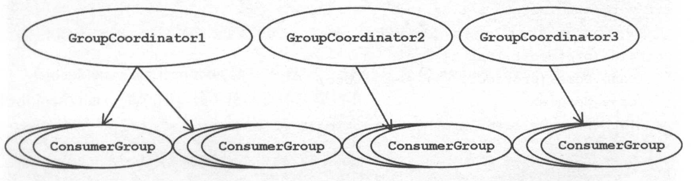

功能:
1. 负责处理JoinGroupRequest和SyncGroupRequest完成consumer group中分区的分配工作；
2. 通过GroupMetadataManager和内部topic"Offsets Topic"维护offset信息,即使出现消费者宕机，也可以找回之前提交的offset
3. 记录consumer group的相关信息，即使broker宕机导致consumer group由新的GroupCoordinator进行管理，新GroupCoordinator也可以知道consumer group中每个消费者负责处理哪个分区等信息；
4. 通过心跳检测消费者的状态

并且会记录每个consumer group 的offset信息

GroupCoordinator使用MemberMetadata记录消费者的元数据
GroupMetadata记录了consumer group的元数据

GroupCoordinator使用GroupTopicPartiton维护consumer group的分区的消费关系，使用OffsetAndMetadata记录offset的相关信息

####GroupMetadataManager####
是GroupCoordinator中负责consumer group 元数据以及对应offset的信息组件。GroupMetadataManager底层使用Offsets Topic,以消息的形式存储consumer group的GroupMetadata信息以及消费的每个分区的offset

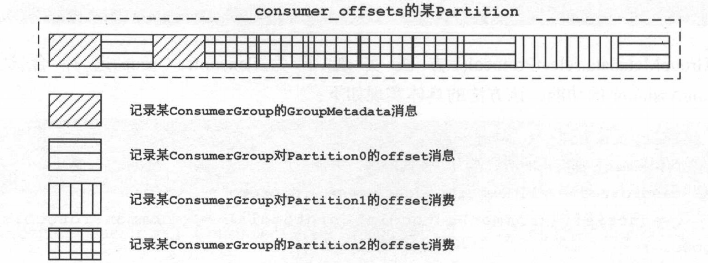

**groupCache管理与offsetsCache管理**
主要是对groupCache和offsetsCache的增删，以及删除时候做的一些事情

**查找GroupCoordinator**
KafkaApis.handleGroupCoordinatorRequest()函数负责处理
消费者与GroupCoorinator交互之前，首先会发送GroupCoordinatorRequest到负载较小的broker，目的是查询管理其所在的consumer group对应的GroupCoordinator的网络位置。
之后消费者会连接到GroupCoordinator，发送剩余的JoinGroupRequest和SyncGroupRequest

GroupCoordinator与partition与consumer group的对应关系：
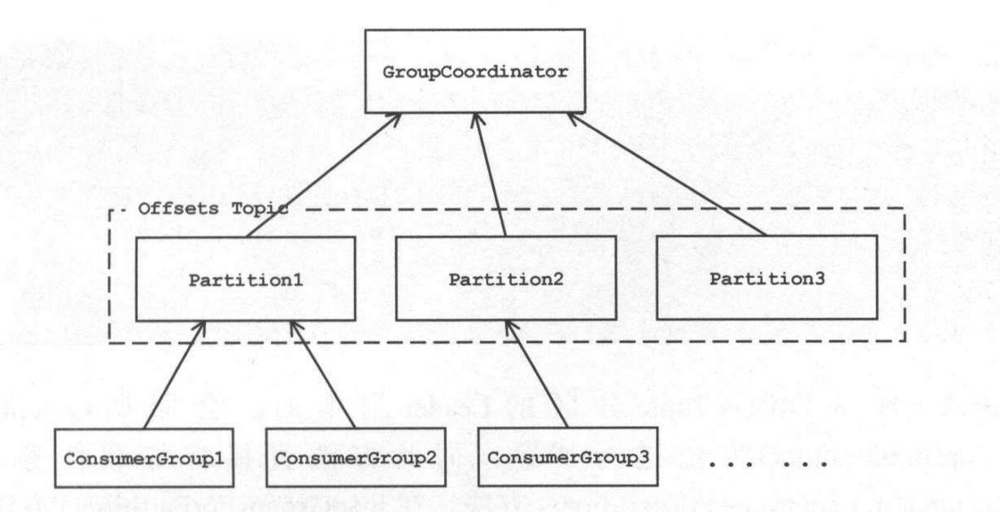

**GroupCoordinator迁移**
默认配置下，offsets topic有50个分区，每个分区有3个副本。
当某个leader副本所在的broker出现故障时，会发生迁移，那么consumer group则由新leader副本所在的broker上运行的GroupCoordinator负责管理。

在KafkaApis.handleLeaderAndIsrRequest()函数中进行处理

当broker成为offsets topic分区的leader副本时，会回调GroupCoordiantor.handleGroupImmigration()函数进行加载，
在GroupCoordiantor.loadGrousForPartition()函数中，通过KafkaScheduler以任务的形式调用loadGroupsAndOffsets()函数，而当前线程直接返回。

步骤：
1. 检测当前offsets topic分区是否正在加载。如果是，则结束本次加载操作，否则将其加入loadingPartitions集合，标识该分区正在进行加载
2. 通过ReplicaManager组件得到此分区对应的log对象。
3. 从log对象中的第一个LogSegment开始加载，加载过程中可能会碰到记录了offset信息的消息，也有可能碰到记录GroupMetadata信息的消息，还有可能是"删除标记"消息，需要区分处理
	a. 如果是记录offset信息的消息且是"删除标记"，则删除offsetsCache集合中对应的OffsetAndMetadata对象。
	b. 如果是记录offset信息的消息且不是"删除标记"，则解析消息形成OffsetAndMetadata对象，添加到offsetsCache集合中。
	c. 如果是记录GroupMetadata信息的消息，则统计是否为"删除标记"，在步骤4中处理
4. 根据步骤3.c中的统计，将需要加载的GroupMetadata信息加载到groupsCache集合中，并检测需要删除的GroupMetadata信息是否还在groupsCache集合中
5. 将当前offsets topic分区的id从loadingPartitions集合移入ownedPartitions集合，标识该分区加载完成，当前GroupCoordinator开始正式负责管理其对应的consumer group

当broker成为offsets topic分区的follower副本时，会回调GroupCoordinator.handleGroupEmigration()函数进行清除工作。
主要是removeGroupsAndOffsets()函数：
1. 从ownedPartitions集合中将对应的offsets topic分区删除，标识当前GroupCoordinator不再管理其对应的consumer group
2. 遍历offsetsCache集合，将此分区对应的OffsetAndMetadata全部清除
3. 遍历groupsCache集合，将此分区对应的GroupMetadata全部清除

**SyncGroupRequest相关处理**
consumer group的leader消费者通过SyncGroupRequest将分区的分配结果发送给GroupCoordinator，GroupCoordinator会根据分配结果形成SyncGroupResponse返回给所有消费者，消费者收到SyncGroupResponse后进行解析

GroupCoordinator除了会将根据分区分配结果发送给所有消费者，还会将其形成消息，追加到对应的offsets topic分区总。

GroupMetadataManager.prepareStoreGroup()函数实现了根据分区分配结果创建消息的功能

**OffsetCommitRequest相关处理**
消费者在进行正常的消费过程以及rebalance操作之前，都会进行提交offset的操作，其核心人物是将消费者消费的每个分区对应的offset封装成OffsetCommitRequest发送给GroupCoordinator。
GroupCoordinator会将这些offset封装成消息，追加到对应的offsets topic分区中

**OffsetFetchRequest与ListGroupsRequest相关处理**
当Consumer group宕机后重新上线时，可以通过向GroupCoordinator发送OffsetFetchRequest获取最近一次提交的offset，并从此位置重新开始进行消费。
GroupCoordinator在收到OffsetFetchRequest后会提交给GroupMetadataManager进行处理，他会根据请求中的groupId查找对应的OffsetAndMetadata对象，并返回给消费者。

从KafkaApis.handleOffsetFetchRequest()开始

####GroupCoordinator分析####

**GroupState**
PreparingRebalance:consumer group正在准备进行Rebalance
当consumer group处于此状态时，GroupCoordinator可以正常的处理OffsetFetchRequest、LeaveGroupRequest、OffsetCommitRequest,
但是对于收到HeartbeatRequest和SyncGroupRequest，则会在其响应中携带REBALANCE_IN_PROGRESS错误码进行标识。
当收到JoinGroupRequest时，GroupCoordinator会先创建对应的DelayJoin，等待条件满足后对其进行响应
PreparingRebalance -> AwaitingSync:当有DelayedJoin超时或是consumer group之前的member都已经重新申请加入时进行切换

AwaitingSync:consumer group当前正在等待group leader将分区的分配结果发送到GroupCoordinator
当consumer group处于AwaitingSync时，标识正在等待Group leader的SyncGroupRequest.当GroupCoordinator收到OffsetCommitRequest和HeartbeatRequest请求时，会在其响应中携带REBALANCE_IN_PROGRESS错误码进行标识。
对于来自group follower的SyncGroupRequest，则直接抛弃，知道收到group leader的SyncGroupRequest一起响应
AwaitingSync -> Stable：当GroupCoordinator收到group leader发来SyncGroupRequest时进行切换
AwaitingSync -> PreparingRebalance：有三种情况可能导致此状态切换，一是有member加入或退出consumer group，二是有新的member请求加入consumer group，三是consumer group中的member心跳超时

Stable：标识consumer group处于正常状态，也是consumer group的初始状态
针对该状态的consumer group，GroupCoordinator可以处理所有的请求，例如：OffsetCommitRequest、HeartbeatRequest、OffsetFetchRequest、来自group follower的JoinGroupRequest、来自consumer group中现有member的SyncGroupRequest
Stable -> PreparingRebalance：有四种情况会导致此状态切换，一是consumer group中现有member心跳检测超时，二是有member主动退出，三是当期那group leader发送JoinGroupRequest，四是有新的member请求加入consumer group

Dead:consumer group中已经没有member存在
处于此状态的consuemr group中没有member，其对应的GroupMetadata也将被删除。对于此状态的consumer group，除了OffsetCommitRequest，其他请求的响应中都会携带UNKNOWN_MEMBER_ID错误码进行标识。

**rebalance的三个步骤**
JoinGroupRequest -> SyncGroupRequest

**JoinGroupRequest**
由KafkaApis.handleJoinGroupRequest()函数处理。
首先进行权限验证，之后将JoinGroupRequest委托给GroupCoordinator进行处理。

**DelayedJoin**
延迟操作，主要功能是等待consumer group中所有的消费者发送JoinGroupRequest申请加入。
每当处理完新收到的JoinGroupRequest时，都会检测相关的DelayedJoin是否能过完成，经过一段时间等待，DelayedJoin也会到期执行

**HeartbeatRequest分析**
由KafkaApis.handleHeartbeatRequest()函数处理。
他负责验证权限，定义回调函数，并将请求委托给GroupCoordinator进行处理。

**SyncGroupRequest分析**
由KafkaApis.handleSyncGroupRequest()函数处理。
定义相关的回调函数，并将请求委托给GroupCoordinator进行处理。

**OffsetCommitRequest分析**
由KafkaApis.handleOffsetCommitRequest()函数处理。
定义相关的回调函数，并将请求委托给GroupCoordinator进行处理。

**LeaveGroupRequest分析**
当消费者离开consumer group，例如调用unsubscribe()函数取消对topic的订阅时，会向GroupCoordinator发送LeaveGroupRequest。
由KafkaApis.handleLeaveGroupRequest()函数处理。
定义相关的回调函数，并将请求委托给GroupCoordinator进行处理。

**onGroupLoaded和onGroupUnloaded**
GroupCoordinator.onGroupLoaded()函数是在GroupCoordinator.handleGroupImmigration()函数中传入GroupMetadataManager.loadGroupsForPartition()函数的回调函数。当出现GroupMetadata重复加载时，会调用它更新心跳

GroupCoordinator.onGroupUnloaded()函数是在GroupCoordinator.handleGroupEmigration()函数中传入GroupMetadataManager.removeGroupsForPartition()函数的回调函数。它会在GroupMetadata被删除前，将consumer group状态转换成Dead，并根据之前的consumer group状态进行相应的请清理操作

##身份认证与权限控制##
身份认证:客户端(生产者或消费者)通过某些凭证，如用户名/密码或是SSL证书，让服务端确认客户端的真实身份
	身份认证在kafka中的具体体现是服务器是否允许当前请求的客户端建立连接。
权限控制:服务端根据客户端的身份，决定对某些资源是否有某些操作权限。
	权限控制体现在对消息的读写等方面的权限上。
	
####身份认证####


